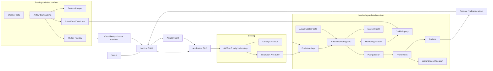

# Weather Prediction MLOps - System Design

## 1. Mục tiêu và phạm vi

Hệ thống dự báo thời tiết Hà Nội lúc 12:00, dự báo nhiệt độ và khả năng mưa trong 7 ngày tiếp theo. Kiến trúc bao phủ training, model release, canary deployment, prediction serving, monitoring và retraining decision.

Training và promotion là hai bước độc lập: training DAG tạo candidate; candidate chỉ trở thành production sau khi được deploy, kiểm tra canary và promote.

## 2. Nguyên tắc thiết kế

- **Release bất biến:** mỗi model được định danh bằng `release_id`, truyền từ manifest đến API, prediction log, monitoring và Data Lake.
- **Monitoring theo release:** chỉ dùng dữ liệu thuộc release đang có trong `production_manifest.json`.
- **Tách metric:** training/evaluation metric khác với production monitoring metric.
- **Không phá hủy dữ liệu:** log, MLflow artifact, Data Lake partition và release archive cũ không bị xóa.
- **Least privilege:** Jenkins dùng quyền triển khai; EC2 dùng IAM Instance Profile để đọc/ghi AWS resources cần thiết.

## 3. Tổng quan kiến trúc



## 4. Thành phần và trách nhiệm

| Thành phần | Trách nhiệm | Interface/artifact |
|---|---|---|
| Airflow training DAG | Ingest, validate, feature engineering, train, evaluate, register | `weather_7d_training` |
| MLflow | Lưu experiment, run, metric, model URI và alias | MLflow tracking/registry |
| S3 | Lưu model artifact, feature artifact và monitoring Data Lake | `weather-7d/...` |
| Jenkins | Build image, deploy canary, set weight, promote, rollback | `Jenkinsfile*`, `scripts/` |
| ECR | Docker image registry | ECR repository |
| EC2 | Chạy Docker Compose và các service production | Application host |
| AWS ALB | Chia traffic champion/canary | Weighted target groups |
| Champion API | Model production chính thức | Port `8000` |
| Canary API | Model candidate được quan sát | Port `8001` |
| Pushgateway | Nhận metric từ Airflow jobs | Port `9091` |
| Prometheus | Scrape và lưu time series | Port `9090` |
| Grafana | Dashboard service/model quality | Port `3000` |
| Alertmanager | Routing cảnh báo, Telegram template | Port `9093` |
| DuckDB | Query Parquet trực tiếp | `src.production.cli_query` |
| Evidently | Phát hiện feature drift | HTML/JSON report |

## 5. Model lifecycle

```text
Ingest -> Validate -> Build features -> Train candidates -> Evaluate
  -> Register candidate -> Deploy canary -> Set ALB weight
  -> Observe -> Promote hoặc Rollback
```

### 5.1. Training

`airflow/dags/weather_training_pipeline.py` chạy tuần tự:

```text
ingest
  -> validate_data
  -> build_and_store_features
  -> train_candidates
  -> evaluate_candidates
  -> register_candidate
  -> archive_candidate_artifacts
```

Training tạo:

- `candidate_manifest.json`;
- `evaluation_manifest.json`;
- `evaluation_metrics.json` và `evaluation_metrics.csv`;
- `registry_manifest.json`;
- `candidate_serving_manifest.json`;
- MLflow model runs, artifacts và aliases.

RMSE, MAE và F1 trong bước này là metric trên validation/test data. Chúng được lưu trong artifact/MLflow; source hiện không dùng chúng làm production monitoring series trong Grafana.

### 5.2. Promotion

Promotion nằm ngoài training DAG và thường do Jenkins thực hiện:

```text
DEPLOY_CANARY -> SET_WEIGHT -> kiểm tra health/routing
              -> quan sát -> PROMOTE hoặc ROLLBACK
```

`src/production/promotion.py` tạo `production_manifest.json`, đặt `stage=production`, gắn `release_id` và tạo `champion_manifest.json`. Candidate không được promote nếu fail quality gate.

## 6. Serving API

FastAPI đọc manifest/model từ thư mục `models/` với quyền read-only.

```text
GET  /ready
GET  /api/v1/model/info
POST /api/v1/predict
GET  /metrics
```

`/api/v1/predict` trả metadata truy xuất nguồn gốc như `request_id`, `model_track` và `model_release_id`, cùng forecast 7 ngày.

Log được tách theo track:

```text
Champion: /app/monitoring/predictions/api_predictions.jsonl
Canary:   /app/monitoring/predictions/api_predictions_canary.jsonl
```

`simulation/generate_prediction_logs.py` gọi API thật bằng dữ liệu giả lập để tạo prediction log. Script không tự động trigger monitoring DAG.

## 7. Canary deployment và ALB

ALB phân phối request giữa champion và candidate target group theo weight. Ví dụ `90/10` chỉ là cấu hình minh họa; tỷ lệ thực tế cần đo bằng request qua ALB.

Jenkins workflow:

- `DEPLOY_CANARY`: build/push image và deploy candidate;
- `SET_WEIGHT`: cập nhật ALB listener rule/target group weight;
- `PROMOTE`: chuyển candidate thành champion và reset trạng thái monitoring;
- `ROLLBACK`: giữ champion hiện tại và đưa candidate về 0% traffic.

`simulation/test_alb_routing.py` đo `model_track` trong response để kiểm tra phân bố request thực tế.

## 8. Monitoring và decision loop

`airflow/dags/weather_monitoring_pipeline.py` chạy:

```text
check_production_manifest
  -> collect_actuals_from_open_meteo
  -> materialize_datalake
  -> calculate_performance
  -> run_drift_checks
  -> archive_monitoring_artifacts
```

### 8.1. Performance monitoring

Monitoring join prediction log với actual weather data để tạo `monitoring_dataset.parquet`. Sau đó tính theo horizon:

```text
RMSE, MAE, Rain F1
```

Các metric này được push lên Pushgateway bằng:

```text
weather_model_rmse
weather_model_mae
weather_model_rain_f1
```

Do đó chúng phản ánh performance production sau khi có actual data, không phải training metric ban đầu.

### 8.2. Drift và trạng thái quyết định

Evidently so sánh reference/current feature data. Monitoring publish các tín hiệu:

```text
weather_model_drift_detected
weather_model_drifted_feature_count
weather_model_performance_degraded
weather_model_retraining_required
weather_model_release_info
```

Các tín hiệu này phục vụ quyết định vận hành:

```text
healthy -> tiếp tục phục vụ
drift/performance degraded -> cảnh báo và lên kế hoạch retrain
canary không ổn định -> rollback
canary ổn định -> promote
```

Sau promote, monitoring state được khởi tạo healthy. Khi chưa có prediction/actual data của release mới, chưa nên diễn giải RMSE/MAE/F1 production là đã được đo.

## 9. Data Lake và DuckDB

Monitoring datasets ở dạng Parquet và được partition theo ngày/release:

```text
s3://<bucket>/weather-7d/bronze/event_date=<date>/release=<release_id>/
```

Các dataset chính là predictions, actuals và `monitoring_dataset.parquet`. DuckDB đọc Parquet trực tiếp để lọc release, join dữ liệu, so sánh model và điều tra lịch sử.

Data Lake là lớp lưu trữ/query lịch sử; Prometheus là lớp time-series cho dashboard/alert. Không dùng Prometheus thay cho Data Lake.

## 10. Observability

Prometheus lấy metric từ API và Pushgateway; Grafana đọc Prometheus. Dashboard hiện quan sát:

- request rate và latency của service;
- active model release;
- RMSE, MAE, Rain F1 theo horizon sau monitoring;
- drift detected;
- performance degraded;
- retraining required.

Request rate/latency là service metrics. Chúng không tự động phân biệt release nếu metric không có label `release_id`; việc phân biệt champion/canary nằm ở routing và `model_track` trong response/log.

## 11. Security và IAM

### Jenkins

Jenkins cần quyền giới hạn để push image lên ECR và thực hiện deployment/update được cấp phép. AWS credentials/SSH key được quản lý bằng Jenkins Credentials hoặc IAM role, không commit vào source.

### EC2

EC2 dùng IAM Instance Profile/Role để pull image từ ECR và đọc/ghi S3 artifact/Data Lake. Không lưu access key trong `.env`, source code, image hoặc log.

Các quyền S3 cần được giới hạn theo bucket/prefix; thông thường chỉ cấp những thao tác cần thiết như `s3:GetObject`, `s3:PutObject`, `s3:ListBucket`.

## 12. Failure handling và rollback

1. `/ready` không healthy: không đưa target vào traffic.
2. Candidate fail promotion gate: không promote.
3. Canary drift hoặc performance degradation: giữ champion và rollback traffic.
4. Monitoring DAG lỗi: giữ artifact để điều tra, không xóa lịch sử.
5. Release mới chưa có log: trạng thái monitoring được reset an toàn, nhưng production quality chưa có đủ dữ liệu.

Rollback phải khôi phục deployment/manifest/alias phù hợp với champion. Release cũ vẫn được giữ để điều tra và tái lập.

## 13. Source map

| Concern | Source |
|---|---|
| Training DAG | `airflow/dags/weather_training_pipeline.py` |
| Monitoring DAG | `airflow/dags/weather_monitoring_pipeline.py` |
| Evaluation | `src/production/evaluation.py` |
| Registry | `src/production/registry.py` |
| Promotion | `src/production/promotion.py`, `src/production/cli_promote.py` |
| Serving API | `src/production/serving.py` |
| Performance monitoring | `src/production/monitoring.py` |
| Data Lake | `src/production/datalake.py` |
| Actual weather data | `src/production/actuals.py` |
| Drift detection | `src/production/drift.py` |
| Prediction simulation | `simulation/generate_prediction_logs.py` |
| Healthy baseline | `simulation/restore_healthy_baseline.py` |
| ALB simulation | `simulation/test_alb_routing.py` |
| Local stack | `docker-compose.yml` |
| Prometheus/Grafana/Alertmanager | `monitoring/` |
| Deployment | `Jenkinsfile`, `Jenkinsfile.application`, `scripts/` |

## 14. Validation checklist

```bash
docker compose ps
curl http://localhost:8000/ready
curl http://localhost:8000/api/v1/model/info
docker compose exec -T airflow-scheduler airflow dags list-runs --dag-id weather_7d_training --output table
docker compose exec -T airflow-scheduler airflow dags list-runs --dag-id weather_7d_monitoring --output table
curl http://localhost:9091/metrics | grep weather_model
curl http://localhost:3000/api/health
python3 -m compileall -q src airflow/dags simulation
git diff --check
```
