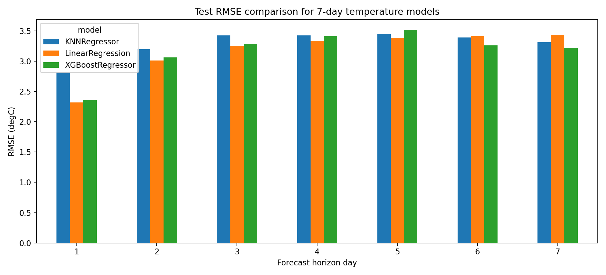
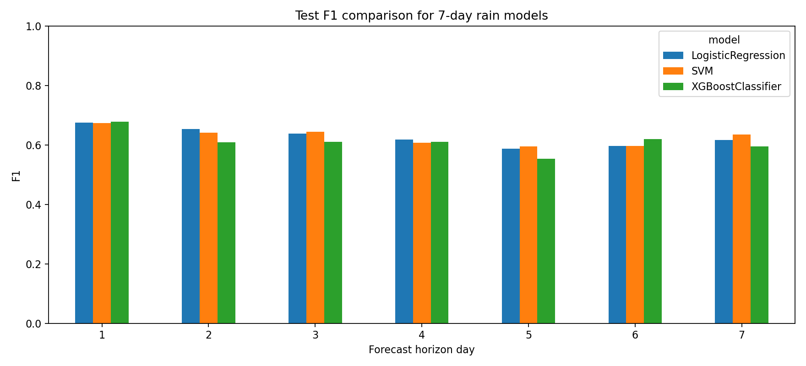
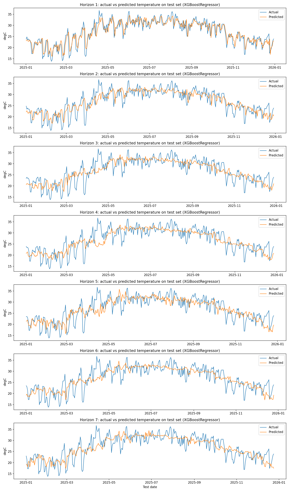
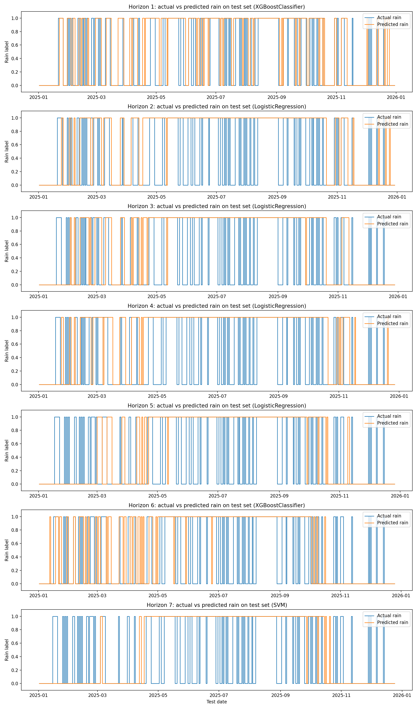

# Tóm tắt

Báo cáo này tổng hợp toàn bộ kết quả từ bốn tài liệu thực nghiệm của dự án: `final_results.md`, `final_results_7day.md`, `final_results_7day` phiên bản tuned và `tuned_vs_original_summary.md`. Mục tiêu nghiên cứu là xây dựng hệ thống dự báo thời tiết Hà Nội lúc 12:00 trưa bằng các mô hình học máy. Dự án gồm hai cấp độ bài toán: dự báo ngày kế tiếp và dự báo liên tiếp 7 ngày trong tương lai. Ở mỗi cấp độ, hệ thống giải quyết đồng thời hai nhiệm vụ: hồi quy nhiệt độ và phân loại mưa.

Dữ liệu được lấy từ Open-Meteo, bao gồm 52.608 bản ghi theo giờ trong giai đoạn 2020-2025. Sau khi tiền xử lý và chỉ giữ các quan sát lúc 12:00, tập dữ liệu còn 2.192 bản ghi. Từ dữ liệu này, hệ thống tạo đặc trưng thời gian, đặc trưng trễ và đặc trưng rolling để mô hình học được quan hệ giữa trạng thái khí tượng hiện tại, quá khứ gần và thời tiết tương lai. Dữ liệu được chia theo thời gian: training giai đoạn 2020-2023, validation năm 2024 và test năm 2025.

Kết quả dự báo ngày kế tiếp cho thấy Linear Regression đạt hiệu quả tốt nhất cho bài toán nhiệt độ trên test set với RMSE 2,319°C và R2 0,808. Đối với bài toán mưa ngày kế tiếp, SVM được chọn theo F1 trên validation set và đạt F1 test 0,673, trong khi Logistic Regression đạt F1 test 0,687 nhưng không được chọn do nguyên tắc lựa chọn mô hình phải dựa trên validation set. Với bài toán dự báo 7 ngày, phiên bản tuned tăng số lần tìm kiếm cấu hình trong `RandomizedSearchCV` từ 4 lên 20. Kết quả tuned cải thiện RMSE trung bình của nhiệt độ từ 3,290 xuống 3,159 và cải thiện F1 trung bình của mưa từ 0,625 lên 0,632.

# 1. Giới thiệu

Dự báo thời tiết là một bài toán có giá trị thực tiễn cao vì ảnh hưởng trực tiếp đến sinh hoạt, giao thông, nông nghiệp, lao động ngoài trời và các hoạt động xã hội. Trong phạm vi dự án này, hệ thống tập trung vào thời điểm 12:00 trưa tại Hà Nội. Việc cố định thời điểm dự báo giúp bài toán rõ ràng hơn so với dự báo toàn bộ ngày, đồng thời làm giảm nhiễu do biến động theo giờ.

Dự án được thiết kế như một hệ thống học máy có giám sát. Từ dữ liệu khí tượng lịch sử, mô hình học ánh xạ từ các đặc trưng thời tiết tại thời điểm hiện tại và quá khứ sang trạng thái thời tiết trong tương lai. Hai bài toán chính được đặt ra:

- Dự báo nhiệt độ lúc 12:00 trong tương lai, là bài toán hồi quy.
- Dự báo có mưa hay không lúc 12:00 trong tương lai, là bài toán phân loại nhị phân.

Ngoài hai đầu ra chính, báo cáo còn suy ra mức thời tiết từ nhiệt độ dự báo. Quy tắc suy diễn được định nghĩa như sau:

```text
temperature < 22        -> cool
22 <= temperature <= 30 -> normal
temperature > 30        -> hot
```

Mức thời tiết không được huấn luyện bằng một mô hình riêng. Đây là một quyết định hợp lý vì mức thời tiết là biến được suy ra trực tiếp từ nhiệt độ, nếu huấn luyện riêng có thể tạo thêm sai số không cần thiết.

# 2. Dữ liệu nghiên cứu

## 2.1. Nguồn dữ liệu và phạm vi

Dữ liệu được thu thập từ Open-Meteo cho khu vực Hà Nội. Tập dữ liệu ban đầu gồm các bản ghi theo giờ trong giai đoạn từ ngày 2020-01-01 đến ngày 2025-12-31. Các biến khí tượng chính bao gồm nhiệt độ, độ ẩm tương đối, lượng mưa, mây che phủ, áp suất mực nước biển, tốc độ gió ở độ cao 10m và bức xạ sóng ngắn.

Sau khi chỉ giữ các quan sát lúc 12:00, tập dữ liệu có 2.192 bản ghi. Khi tạo target ngày kế tiếp, số mẫu supervised learning còn 2.191 vì bản ghi cuối cùng không có nhãn tương lai tương ứng.

| Thuộc tính | Giá trị |
|---|---:|
| Số bản ghi theo giờ ban đầu | 52.608 |
| Số bản ghi lúc 12:00 sau tiền xử lý | 2.192 |
| Số mẫu supervised cho bài toán ngày kế tiếp | 2.191 |
| Khoảng thời gian dữ liệu | 2020-01-01 đến 2025-12-31 |
| Tỷ lệ mưa ngày kế tiếp | 0,390 |
| Bản ghi 12:00 mới nhất dùng cho suy luận 7 ngày | 2025-12-30 12:00:00 |

## 2.2. Thống kê mô tả

Thống kê mô tả cho thấy nhiệt độ trung bình lúc 12:00 là 26,906°C, độ lệch chuẩn 5,497°C, giá trị nhỏ nhất 8,9°C và lớn nhất 38,0°C. Điều này phản ánh rõ đặc điểm mùa vụ của Hà Nội: mùa lạnh có thể xuống dưới 10°C vào buổi trưa, trong khi mùa nóng có thể đạt gần 38°C.

| Biến | Mean | Std | Min | Median | Max |
|---|---:|---:|---:|---:|---:|
| temperature | 26,906 | 5,497 | 8,900 | 27,800 | 38,000 |
| humidity | 67,167 | 12,306 | 22,000 | 68,000 | 96,000 |
| precipitation | 0,255 | 0,957 | 0,000 | 0,000 | 13,800 |
| cloud_cover | 77,693 | 33,656 | 0,000 | 99,000 | 100,000 |
| pressure_msl | 1011,833 | 7,343 | 990,500 | 1011,300 | 1032,300 |
| wind_speed_10m | 9,766 | 5,027 | 0,000 | 9,300 | 38,000 |
| shortwave_radiation | 547,390 | 235,568 | 59,000 | 568,500 | 949,000 |

Lượng mưa có trung vị bằng 0 mm, nghĩa là ít nhất một nửa số ngày không có mưa tại thời điểm 12:00. Đồng thời, độ lệch chuẩn của lượng mưa lớn hơn giá trị trung bình, cho thấy phân phối lượng mưa lệch phải: đa số ngày không mưa hoặc mưa rất nhỏ, nhưng một số ngày có lượng mưa lớn. Đây là lý do bài toán phân loại mưa khó hơn bài toán hồi quy nhiệt độ, vì lớp mưa có tính thưa và biến động mạnh.

# 3. Tiền xử lý và tạo đặc trưng

Quy trình tiền xử lý bắt đầu bằng việc loại bỏ các dòng metadata của Open-Meteo, chuẩn hóa tên cột, chuyển đổi cột thời gian sang kiểu datetime, sắp xếp dữ liệu theo thời gian và loại bỏ timestamp trùng lặp. Sau đó hệ thống chỉ giữ các bản ghi có `hour == 12` để bảo đảm đầu ra dự báo đúng với mục tiêu nghiên cứu.

Một số cột không được sử dụng trong mô hình, gồm `surface_pressure`, `wind_direction_10m` và `rain`. Cột `rain` được loại bỏ vì có thể trùng lặp thông tin với `precipitation`; trong khi đó, target mưa được định nghĩa lại từ lượng mưa tương lai theo quy tắc `precipitation > 0`. Nếu xuất hiện missing value ở cột số, hệ thống điền bằng median để giảm ảnh hưởng của ngoại lệ.

Các nhóm đặc trưng chính gồm:

- Đặc trưng thời gian: `month`, `day_of_year`, `season`.
- Đặc trưng trễ: lag 1, 3 và 7 ngày cho nhiệt độ, độ ẩm và lượng mưa.
- Đặc trưng rolling: trung bình trượt nhiệt độ, trung bình trượt độ ẩm và tổng lượng mưa trên cửa sổ 3 và 7 ngày.

Một điểm quan trọng là các đặc trưng rolling được tính bằng `shift(1)` trước khi áp dụng `rolling()`. Điều này bảo đảm mô hình chỉ nhìn thấy thông tin quá khứ, không sử dụng dữ liệu của chính ngày cần dự báo. Đây là biện pháp kiểm soát rò rỉ dữ liệu trong bài toán chuỗi thời gian.

# 4. Thiết kế thực nghiệm

## 4.1. Chia tập dữ liệu theo thời gian

Dữ liệu được chia theo trình tự thời gian thay vì chia ngẫu nhiên:

| Tập dữ liệu | Giai đoạn | Vai trò |
|---|---|---|
| Training | 2020-2023 | Huấn luyện trọng số và tham số mô hình |
| Validation | 2024 | Chọn mô hình, chọn cấu hình và chọn threshold |
| Test | 2025 | Đánh giá cuối cùng trên dữ liệu chưa từng dùng để lựa chọn |

Cách chia này phù hợp với bản chất dự báo thời tiết. Trong thực tế, mô hình chỉ có thể học từ quá khứ để dự báo tương lai, vì vậy không được trộn dữ liệu các năm ngẫu nhiên. Validation set đóng vai trò mô phỏng giai đoạn tương lai gần dùng để chọn mô hình. Test set là giai đoạn tương lai xa hơn, chỉ dùng một lần cho đánh giá cuối cùng.

## 4.2. Baseline

Dự án sử dụng baseline để kiểm tra liệu mô hình học máy có tạo ra giá trị thực sự hay không.

Đối với nhiệt độ, baseline là persistence baseline: dự báo nhiệt độ ngày mai bằng nhiệt độ hôm nay. Đây là baseline mạnh vì nhiệt độ có tính liên tục theo ngày.

Đối với mưa, baseline là majority class baseline: luôn dự báo lớp phổ biến nhất trong training set. Đây tương đương với `DummyClassifier(strategy="most_frequent")`. Baseline này thường đạt accuracy không quá thấp nếu dữ liệu lệch lớp, nhưng F1 cho lớp mưa có thể bằng 0 vì mô hình không phát hiện được ngày mưa.

## 4.3. Mô hình

Nhóm hồi quy nhiệt độ gồm ba mô hình:

- Linear Regression: mô hình tuyến tính, học hệ số cho từng đặc trưng để cực tiểu hóa tổng bình phương sai số.
- KNN Regressor: mô hình dựa trên láng giềng gần nhất, dự báo bằng trung bình của các điểm gần trong không gian đặc trưng.
- XGBoost Regressor: mô hình boosting cây quyết định, học tuần tự nhiều cây để sửa lỗi của các cây trước.

Nhóm phân loại mưa gồm ba mô hình:

- Logistic Regression với `class_weight='balanced'`.
- SVM với `class_weight='balanced'`.
- XGBoost Classifier với `scale_pos_weight` tự động theo tỷ lệ lớp.

Với các mô hình cần chuẩn hóa thang đo như Linear Regression, Logistic Regression, SVM và KNN, pipeline sử dụng `StandardScaler`. Với XGBoost, mô hình cây không yêu cầu chuẩn hóa đặc trưng nên được huấn luyện trực tiếp.

## 4.4. Tuning tham số và threshold

Tuning tham số được thực hiện trên training set bằng `RandomizedSearchCV` kết hợp `TimeSeriesSplit(n_splits=5)`. `TimeSeriesSplit` giữ đúng thứ tự thời gian trong cross-validation: mỗi fold huấn luyện trên một đoạn quá khứ và kiểm tra trên đoạn ngay sau đó. Cách này phù hợp hơn KFold ngẫu nhiên vì không đưa dữ liệu tương lai vào quá trình học.

Ở bài toán hồi quy, tuning chọn cấu hình có RMSE cross-validation thấp nhất. Các cấu hình có thể bao gồm số láng giềng của KNN hoặc các tham số XGBoost như số cây, độ sâu cây và learning rate.

Ở bài toán phân loại mưa, tuning mô hình chọn cấu hình có F1 cross-validation tốt. Sau khi mô hình tạo xác suất mưa, hệ thống tiếp tục tuning threshold trên validation set. Threshold được thử trong khoảng 0,10 đến 0,90 với bước 0,05; threshold tốt nhất là ngưỡng cho F1 validation cao nhất. Như vậy, nhóm classification không chỉ tuning tham số mô hình mà còn tuning ngưỡng ra quyết định mưa/không mưa.

# 5. Phân tích dữ liệu và trực quan hóa

## 5.1. Correlation heatmap


Correlation heatmap mô tả mức tương quan tuyến tính giữa các biến. Trong dự án này, các biến nhiệt độ hiện tại, nhiệt độ lag và rolling temperature có tương quan cao. Điều này phù hợp với bản chất vật lý của nhiệt độ: trạng thái nhiệt hôm nay thường chịu ảnh hưởng mạnh từ những ngày gần trước đó.

Tuy nhiên, tương quan cao cũng đặt ra vấn đề đa cộng tuyến khi diễn giải Linear Regression. Nếu nhiều đặc trưng mang thông tin tương tự nhau, hệ số của từng biến riêng lẻ có thể không ổn định, dù tổng thể mô hình vẫn dự báo tốt. Vì vậy, feature importance hoặc hệ số tuyến tính nên được hiểu như một chỉ báo tham khảo, không phải bằng chứng nhân quả.

## 5.2. PCA


PCA giảm không gian đặc trưng nhiều chiều xuống hai thành phần chính PC1 và PC2. Các giá trị như -4, -2, 0, 2, 4 trên trục PCA là tọa độ trong không gian mới sau phép biến đổi tuyến tính, không còn mang đơn vị khí tượng gốc như °C, mm hay hPa. Điểm nằm gần nhau trên đồ thị PCA nghĩa là chúng có trạng thái đặc trưng tương đối giống nhau sau khi chuẩn hóa và chiếu xuống hai chiều.

Nếu các điểm mưa và không mưa bị chồng lấn trên biểu đồ PCA, điều đó cho thấy bài toán phân loại mưa không dễ tách bằng một ranh giới đơn giản trong hai chiều chính. Đây là một lý do các mô hình phân loại mưa có F1 ở mức trung bình thay vì rất cao.

# 6. Kết quả dự báo ngày kế tiếp

## 6.1. Hồi quy nhiệt độ

Kết quả validation của bài toán nhiệt độ ngày kế tiếp:

| Mô hình | MAE | RMSE | R2 |
|---|---:|---:|---:|
| Linear Regression | 1,811 | 2,375 | 0,814 |
| KNN Regressor | 2,214 | 2,761 | 0,749 |
| XGBoost Regressor | 1,893 | 2,439 | 0,804 |

Kết quả test:

| Mô hình | MAE | RMSE | R2 |
|---|---:|---:|---:|
| Linear Regression | 1,674 | 2,319 | 0,808 |
| KNN Regressor | 2,148 | 2,821 | 0,716 |
| XGBoost Regressor | 1,830 | 2,432 | 0,789 |

Linear Regression được chọn vì có RMSE thấp nhất trên validation set. Trên test set, mô hình này tiếp tục đạt RMSE thấp nhất và R2 cao nhất. Điều này phản ánh rằng dự báo nhiệt độ ngày kế tiếp tại thời điểm 12:00 có cấu trúc tương đối tuyến tính, trong đó nhiệt độ hiện tại, biến mùa vụ, lag và rolling đủ để mô hình tuyến tính học được quan hệ chính.


Biểu đồ actual-predicted và residual cho thấy mô hình dự báo tốt ở vùng nhiệt độ trung bình, nhưng sai số tăng ở những điểm biến động mạnh. Đây là hiện tượng phổ biến trong dự báo thời tiết bằng dữ liệu lịch sử vì các biến cố khí tượng đột ngột có thể cần thêm dữ liệu không gian, ảnh mây, trường áp suất hoặc dữ liệu dự báo số trị để cải thiện.


## 6.2. Phân loại mưa

Kết quả validation của bài toán mưa ngày kế tiếp:

| Mô hình | Accuracy | Precision | Recall | F1 | ROC AUC |
|---|---:|---:|---:|---:|---:|
| Logistic Regression | 0,653 | 0,532 | 0,712 | 0,609 | 0,742 |
| SVM | 0,680 | 0,560 | 0,741 | 0,638 | 0,758 |
| XGBoost Classifier | 0,686 | 0,574 | 0,669 | 0,618 | 0,751 |

Kết quả test:

| Mô hình | Accuracy | Precision | Recall | F1 | ROC AUC |
|---|---:|---:|---:|---:|---:|
| Logistic Regression | 0,720 | 0,612 | 0,783 | 0,687 | 0,785 |
| SVM | 0,717 | 0,616 | 0,741 | 0,673 | 0,774 |
| XGBoost Classifier | 0,698 | 0,611 | 0,636 | 0,623 | 0,767 |

SVM được chọn theo F1 validation. Trên test set, Logistic Regression có F1 cao hơn SVM, nhưng việc chọn Logistic Regression sau khi nhìn test set sẽ làm sai quy trình đánh giá. Vì vậy, báo cáo giữ SVM là mô hình được chọn hợp lệ theo validation set, đồng thời ghi nhận Logistic Regression tổng quát hóa tốt hơn trên năm 2025.


Confusion matrix cho biết số dự báo đúng/sai theo từng lớp. Trong bài toán mưa, false negative nghĩa là thực tế có mưa nhưng mô hình dự báo không mưa; false positive nghĩa là thực tế không mưa nhưng mô hình dự báo có mưa. Tùy ứng dụng, false negative có thể nghiêm trọng hơn vì người dùng có thể không chuẩn bị cho mưa.


# 7. Kết quả dự báo 7 ngày: phiên bản gốc

Phiên bản 7 ngày chuyển bài toán từ dự báo một bước sang dự báo đa horizon. Với mỗi horizon `h = 1..7`, target được định nghĩa:

```text
horizon_temperature = temperature.shift(-h)
horizon_rain = precipitation.shift(-h) > 0
```

Đây là direct multi-horizon forecasting: mỗi horizon có một cặp mô hình riêng cho nhiệt độ và mưa. Cách này tránh lỗi tích lũy như phương pháp recursive, nhưng đòi hỏi huấn luyện nhiều mô hình hơn.

Phiên bản gốc dùng `RandomizedSearchCV n_iter = 4`. Các mô hình được chọn theo validation set như sau:

| Horizon | Mô hình nhiệt độ | RMSE test | Mô hình mưa | F1 test | Threshold mưa |
|---:|---|---:|---|---:|---:|
| 1 | LinearRegression | 2,319 | XGBoostClassifier | 0,652 | 0,20 |
| 2 | LinearRegression | 3,010 | LogisticRegression | 0,653 | 0,40 |
| 3 | XGBoostRegressor | 3,436 | LogisticRegression | 0,638 | 0,45 |
| 4 | XGBoostRegressor | 3,682 | LogisticRegression | 0,617 | 0,40 |
| 5 | XGBoostRegressor | 3,747 | LogisticRegression | 0,587 | 0,50 |
| 6 | XGBoostRegressor | 3,422 | LogisticRegression | 0,597 | 0,40 |
| 7 | XGBoostRegressor | 3,417 | SVM | 0,634 | 0,40 |

Kết quả cho thấy sai số nhiệt độ tăng khi horizon dài hơn. Đây là xu hướng hợp lý: dự báo càng xa thì độ bất định càng lớn. Đối với mưa, F1 dao động quanh 0,587-0,653, phản ánh bài toán phân loại mưa 7 ngày khó hơn do trạng thái mưa phụ thuộc nhiều vào biến động khí quyển ngắn hạn.

Kết quả suy luận 7 ngày từ bản ghi mới nhất 2025-12-30 12:00:

| Ngày dự báo | Nhiệt độ dự báo | Xác suất mưa | Threshold | Nhãn mưa | Mức thời tiết |
|---|---:|---:|---:|---|---|
| 2025-12-31 | 23,109 | 0,159 | 0,20 | no_rain | normal |
| 2026-01-01 | 22,466 | 0,229 | 0,40 | no_rain | normal |
| 2026-01-02 | 18,532 | 0,241 | 0,45 | no_rain | cool |
| 2026-01-03 | 18,871 | 0,268 | 0,40 | no_rain | cool |
| 2026-01-04 | 18,589 | 0,261 | 0,50 | no_rain | cool |
| 2026-01-05 | 18,052 | 0,296 | 0,40 | no_rain | cool |
| 2026-01-06 | 18,237 | 0,285 | 0,40 | no_rain | cool |

# 8. Kết quả dự báo 7 ngày: phiên bản tuned

Phiên bản tuned giữ nguyên pipeline nhưng tăng số cấu hình được thử trong `RandomizedSearchCV` từ 4 lên 20. Điều này không thay đổi dữ liệu, không thay đổi cách chia train/validation/test và không ghi đè phiên bản gốc. Mục tiêu là kiểm tra xem việc tìm kiếm tham số sâu hơn có cải thiện kết quả hay không.

Các mô hình được chọn trong phiên bản tuned:

| Horizon | Mô hình nhiệt độ | RMSE validation | RMSE test | Mô hình mưa | F1 validation | F1 test | Threshold |
|---:|---|---:|---:|---|---:|---:|---:|
| 1 | XGBoostRegressor | 2,375 | 2,358 | XGBoostClassifier | 0,672 | 0,678 | 0,35 |
| 2 | XGBoostRegressor | 3,100 | 3,061 | LogisticRegression | 0,668 | 0,653 | 0,40 |
| 3 | XGBoostRegressor | 3,337 | 3,283 | LogisticRegression | 0,647 | 0,638 | 0,45 |
| 4 | XGBoostRegressor | 3,459 | 3,415 | LogisticRegression | 0,641 | 0,617 | 0,40 |
| 5 | XGBoostRegressor | 3,436 | 3,512 | LogisticRegression | 0,628 | 0,587 | 0,50 |
| 6 | XGBoostRegressor | 3,458 | 3,262 | XGBoostClassifier | 0,615 | 0,620 | 0,45 |
| 7 | XGBoostRegressor | 3,516 | 3,220 | SVM | 0,620 | 0,634 | 0,40 |

Trong phiên bản tuned, XGBoostRegressor được chọn cho toàn bộ 7 horizon nhiệt độ. Điều này cho thấy khi dự báo xa hơn một ngày, quan hệ giữa đặc trưng hiện tại/quá khứ và nhiệt độ tương lai không còn tuyến tính đơn giản như bài toán ngày kế tiếp. XGBoost có khả năng học tương tác phi tuyến giữa mùa, độ ẩm, mây, bức xạ, lag và rolling, nên phù hợp hơn cho bài toán đa horizon.





Biểu đồ actual-predicted trên toàn bộ test set giúp đánh giá mô hình tốt nhất theo từng horizon có bám sát dữ liệu thực tế hay không. Với nhiệt độ, dự báo nhìn chung đi theo xu hướng thực tế nhưng độ lệch tăng ở các horizon xa. Với mưa, biểu đồ cho thấy mô hình còn sai khá nhiều, đặc biệt vì mưa là biến rời rạc, thưa và khó dự báo từ dữ liệu lịch sử một điểm.





Quá trình chọn threshold được trực quan hóa bằng đường F1 theo từng ngưỡng. Mỗi horizon có threshold tối ưu riêng vì phân phối xác suất và mức mất cân bằng lớp thay đổi theo khoảng cách dự báo.


Kết quả suy luận 7 ngày của phiên bản tuned:

| Ngày dự báo | Mô hình nhiệt độ | Nhiệt độ dự báo | Mô hình mưa | Xác suất mưa | Threshold | Nhãn mưa | Mức thời tiết |
|---|---|---:|---|---:|---:|---|---|
| 2025-12-31 | XGBoostRegressor | 22,951 | XGBoostClassifier | 0,314 | 0,35 | no_rain | normal |
| 2026-01-01 | XGBoostRegressor | 20,880 | LogisticRegression | 0,229 | 0,40 | no_rain | cool |
| 2026-01-02 | XGBoostRegressor | 20,150 | LogisticRegression | 0,241 | 0,45 | no_rain | cool |
| 2026-01-03 | XGBoostRegressor | 18,374 | LogisticRegression | 0,268 | 0,40 | no_rain | cool |
| 2026-01-04 | XGBoostRegressor | 16,657 | LogisticRegression | 0,261 | 0,50 | no_rain | cool |
| 2026-01-05 | XGBoostRegressor | 17,840 | XGBoostClassifier | 0,127 | 0,45 | no_rain | cool |
| 2026-01-06 | XGBoostRegressor | 18,283 | SVM | 0,285 | 0,40 | no_rain | cool |


# 9. So sánh phiên bản gốc và phiên bản tuned

So sánh tổng hợp cho thấy việc tăng `n_iter` trong `RandomizedSearchCV` tạo cải thiện vừa phải nhưng có ý nghĩa về mặt thực nghiệm.

| Chỉ số | Phiên bản gốc | Phiên bản tuned | Kết luận |
|---|---:|---:|---|
| RMSE test trung bình của nhiệt độ | 3,290 | 3,159 | Cải thiện |
| F1 test trung bình của mưa | 0,625 | 0,632 | Cải thiện |

So sánh theo từng horizon:

| Horizon | RMSE gốc | RMSE tuned | Chênh lệch RMSE | F1 gốc | F1 tuned | Chênh lệch F1 |
|---:|---:|---:|---:|---:|---:|---:|
| 1 | 2,319 | 2,358 | +0,039 | 0,652 | 0,678 | +0,026 |
| 2 | 3,010 | 3,061 | +0,051 | 0,653 | 0,653 | 0,000 |
| 3 | 3,436 | 3,283 | -0,153 | 0,638 | 0,638 | 0,000 |
| 4 | 3,682 | 3,415 | -0,267 | 0,617 | 0,617 | 0,000 |
| 5 | 3,747 | 3,512 | -0,235 | 0,587 | 0,587 | 0,000 |
| 6 | 3,422 | 3,262 | -0,160 | 0,597 | 0,620 | +0,023 |
| 7 | 3,417 | 3,220 | -0,198 | 0,634 | 0,634 | 0,000 |

Phiên bản tuned không tốt hơn ở mọi horizon. Ở horizon 1 và 2, RMSE nhiệt độ tăng nhẹ. Tuy nhiên, từ horizon 3 đến 7, RMSE giảm rõ hơn, đặc biệt ở horizon 4 và 5. Do mục tiêu của pipeline là dự báo toàn bộ 7 ngày, chỉ số trung bình across horizons quan trọng hơn một horizon riêng lẻ. Vì vậy, phiên bản tuned là phiên bản nên được dùng làm báo cáo chính.

Đối với mưa, cải thiện tập trung ở horizon 1 và 6. Các horizon khác không đổi vì mô hình và threshold được chọn giống phiên bản gốc. Điều này cho thấy việc tăng số lần tìm kiếm cấu hình có ích nhưng chưa đủ để giải quyết hoàn toàn độ khó của bài toán mưa.

# 10. Diễn giải các chỉ số đánh giá

MAE là sai số tuyệt đối trung bình. Với nhiệt độ, MAE 1,674 nghĩa là trung bình dự báo lệch khoảng 1,674°C so với thực tế. MAE dễ hiểu nhưng không phạt mạnh các sai số lớn.

RMSE là căn bậc hai của sai số bình phương trung bình. RMSE phạt các lỗi lớn mạnh hơn MAE. Trong dự báo nhiệt độ, RMSE thấp hơn nghĩa là mô hình ít mắc các lỗi dự báo lệch xa.

R2 đo tỷ lệ phương sai của biến mục tiêu được mô hình giải thích. R2 gần 1 là tốt, R2 gần 0 nghĩa là mô hình không tốt hơn nhiều so với việc dự báo bằng giá trị trung bình. Trong dự báo 7 ngày, R2 khoảng 0,55 không phải là quá tốt nếu kỳ vọng dự báo chính xác cao, nhưng cũng không phải vô giá trị vì mô hình vẫn giải thích được hơn một nửa biến thiên của nhiệt độ. Với thời tiết, horizon càng xa thì R2 giảm là điều hợp lý.

Within ±1°C, ±2°C, ±3°C cho biết tỷ lệ dự báo nằm trong một khoảng sai số chấp nhận được. Chỉ số này hữu ích hơn cách nói đúng/sai tuyệt đối trong hồi quy, vì nhiệt độ là biến liên tục. Ví dụ, nếu dự báo 27,5°C trong khi thực tế 28,0°C thì về mặt thực tế vẫn có thể coi là dự báo tốt.

Accuracy là tỷ lệ dự báo đúng tổng thể trong phân loại mưa. Precision cho biết trong các lần mô hình dự báo mưa, bao nhiêu lần thực sự có mưa. Recall cho biết trong các ngày thực sự có mưa, mô hình phát hiện được bao nhiêu. F1 là trung bình điều hòa giữa precision và recall, phù hợp khi dữ liệu mất cân bằng. ROC AUC đo khả năng xếp hạng xác suất giữa lớp mưa và không mưa.

# 11. Thảo luận khoa học

Kết quả nghiên cứu cho thấy bài toán nhiệt độ dễ dự báo hơn bài toán mưa. Nguyên nhân chính là nhiệt độ có tính liên tục và mùa vụ mạnh, trong khi mưa có tính cục bộ, rời rạc và chịu ảnh hưởng của nhiều yếu tố khí quyển khó quan sát trong dữ liệu một điểm. Dữ liệu hiện tại gồm các biến như độ ẩm, áp suất, gió, mây và bức xạ, nhưng các biến này chỉ là quan sát tại Hà Nội lúc 12:00. Chúng không cung cấp đầy đủ cấu trúc không gian của hệ thống thời tiết, ví dụ mây đối lưu, front lạnh, vùng hội tụ hoặc dịch chuyển khối khí.

Trong bài toán ngày kế tiếp, Linear Regression đạt kết quả tốt nhất cho nhiệt độ. Điều này không có nghĩa Linear Regression luôn mạnh hơn XGBoost, mà phản ánh rằng với horizon ngắn và tập dữ liệu hiện có, quan hệ tuyến tính đã đủ hiệu quả. Trong bài toán 7 ngày, XGBoostRegressor lại chiếm ưu thế vì dự báo xa hơn yêu cầu mô hình hóa quan hệ phi tuyến và tương tác đặc trưng phức tạp hơn.

Đối với mưa, việc tuning threshold là cần thiết. Nếu dùng threshold mặc định 0,5, mô hình có thể quá bảo thủ và dự báo nhiều ngày không mưa, đặc biệt khi xác suất mưa thường thấp. Threshold tối ưu theo validation set giúp cân bằng precision và recall theo mục tiêu F1. Tuy nhiên, biểu đồ actual-predicted trên test set cho thấy bài toán mưa vẫn còn nhiều sai lệch, nghĩa là cải thiện threshold chỉ giải quyết phần ra quyết định, không thay thế được việc cần thêm đặc trưng mạnh hơn hoặc dữ liệu khí tượng phong phú hơn.

Feature importance trong báo cáo cần được hiểu theo từng loại mô hình. Với Linear Regression và Logistic Regression, hệ số sau chuẩn hóa cho biết chiều và độ mạnh tương đối của ảnh hưởng tuyến tính. Với XGBoost, importance phản ánh mức độ đặc trưng được dùng trong các cây để giảm lỗi. Với KNN và SVM, permutation importance đo mức suy giảm hiệu năng khi tráo một đặc trưng. Feature importance không phản ánh model nào tốt nhất; chất lượng mô hình phải dựa vào metric validation/test như RMSE, MAE, R2, F1 và ROC AUC.

# 12. Hạn chế

Thứ nhất, dữ liệu chỉ sử dụng một điểm không gian là Hà Nội và chỉ lấy thời điểm 12:00. Điều này giúp bài toán rõ ràng nhưng làm mất thông tin về diễn biến theo giờ và cấu trúc không gian của thời tiết.

Thứ hai, mô hình dự báo 7 ngày dùng direct multi-horizon từ bản ghi hiện tại, không tự sinh toàn bộ chuỗi biến khí hậu tương lai như độ ẩm, áp suất, gió, mây hay bức xạ. Vì vậy, mô hình đang học quan hệ từ trạng thái hiện tại/quá khứ sang target tương lai, chứ không thực hiện mô phỏng khí quyển đầy đủ.

Thứ ba, test set chỉ là năm 2025. Mặc dù đây là đánh giá đúng quy trình, kết quả có thể chịu ảnh hưởng bởi đặc điểm riêng của năm đó. Nếu có thêm nhiều năm dữ liệu, đánh giá sẽ ổn định hơn.

Thứ tư, bài toán mưa được chuyển thành nhị phân `precipitation > 0`. Trong thực tế, mưa rất nhỏ và mưa đáng kể có ý nghĩa sử dụng khác nhau. Một hướng cải thiện là dự báo nhiều mức mưa hoặc dự báo lượng mưa liên tục rồi suy ra nhãn.

# 13. Kết luận và hướng phát triển

Dự án đã xây dựng thành công pipeline học máy cho dự báo thời tiết Hà Nội lúc 12:00, gồm cả dự báo ngày kế tiếp và dự báo 7 ngày. Hệ thống thực hiện đầy đủ các bước: tiền xử lý dữ liệu, phân tích thống kê, trực quan hóa, tạo đặc trưng không rò rỉ dữ liệu, chia train/validation/test theo thời gian, tuning tham số bằng `TimeSeriesSplit`, lựa chọn mô hình bằng validation set, đánh giá cuối trên test set và sinh báo cáo kết quả.

Với bài toán ngày kế tiếp, Linear Regression là mô hình tốt nhất cho nhiệt độ với RMSE test 2,319°C và R2 0,808. Với bài toán mưa ngày kế tiếp, SVM được chọn theo validation F1, dù Logistic Regression có kết quả test cao hơn. Với bài toán dự báo 7 ngày, phiên bản tuned dùng `RandomizedSearchCV n_iter = 20` cải thiện RMSE trung bình của nhiệt độ từ 3,290 xuống 3,159 và F1 trung bình của mưa từ 0,625 lên 0,632. Vì vậy, phiên bản tuned là phiên bản thuyết phục hơn để trình bày trong báo cáo cuối.

Trong tương lai, hệ thống có thể được cải thiện bằng cách bổ sung dữ liệu nhiều thời điểm trong ngày, dữ liệu không gian từ các khu vực lân cận, biến khí tượng dự báo từ mô hình số trị, hoặc dữ liệu ảnh mây/radar nếu có. Ngoài ra, có thể thử các mô hình chuỗi thời gian sâu hơn như LSTM, Temporal Convolutional Network hoặc Transformer, nhưng cần đánh giá cẩn thận để tránh overfitting trên tập dữ liệu còn tương đối nhỏ.

