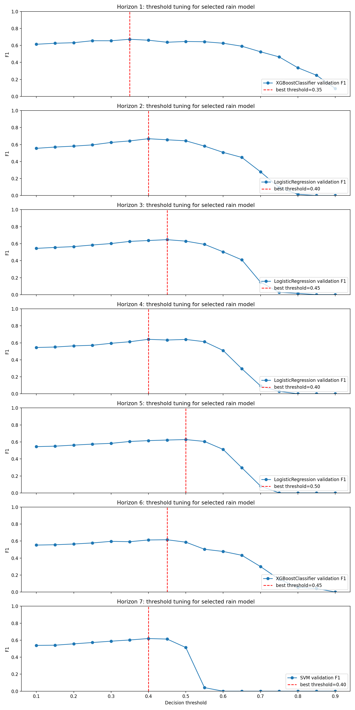

# Tóm tắt

Báo cáo này là phiên bản học thuật nâng cấp của hệ thống dự báo thời tiết Hà Nội lúc 12:00. So với bản báo cáo trước, phiên bản này bổ sung bốn nội dung quan trọng: tham số tối ưu được chọn bởi `RandomizedSearchCV`, biểu đồ hyperparameter tuning riêng cho từng model, so sánh trực tiếp giữa mức tìm kiếm `n_iter=4` và `n_iter=20`, và biểu đồ model comparison dạng line để thể hiện xu hướng theo horizon.

Hệ thống giải quyết hai nhiệm vụ học máy: hồi quy nhiệt độ và phân loại mưa. Với dự báo 7 ngày, bài toán được mô hình hóa theo hướng direct multi-horizon: mỗi horizon từ 1 đến 7 có một mô hình nhiệt độ và một mô hình mưa riêng. Dữ liệu được chia theo thời gian: training giai đoạn 2020-2023, validation năm 2024 và test năm 2025. Nguyên tắc đánh giá là chỉ dùng test set sau khi đã hoàn tất chọn mô hình, chọn cấu hình và chọn threshold.

Kết quả cho thấy tăng số cấu hình tìm kiếm từ `n_iter=4` lên `n_iter=20` cải thiện hiệu năng trung bình của pipeline 7 ngày. RMSE test trung bình của nhiệt độ giảm từ 3.290 xuống 3.159. F1 test trung bình của phân loại mưa tăng từ 0.625 lên 0.632. Mức cải thiện không đồng đều ở mọi horizon, nhưng có ý nghĩa về mặt thực nghiệm vì phiên bản `n_iter=20` khám phá không gian tham số sâu hơn và cho kết quả tốt hơn trên trung bình toàn bộ 7 ngày.

# 1. Mục tiêu nghiên cứu

Mục tiêu của dự án là xây dựng một pipeline học máy có khả năng dự báo thời tiết Hà Nội lúc 12:00 trong tương lai. Đầu ra chính gồm nhiệt độ dự báo, nhãn mưa/không mưa và mức thời tiết suy ra từ nhiệt độ. Bài toán nhiệt độ là hồi quy, trong khi bài toán mưa là phân loại nhị phân với nhãn được định nghĩa từ điều kiện `precipitation > 0`.

Trong bối cảnh dự báo 7 ngày, horizon 1 tương ứng ngày kế tiếp, horizon 2 tương ứng hai ngày sau, và tiếp tục đến horizon 7. Cách tiếp cận này không dự báo đệ quy từng ngày rồi dùng kết quả ngày trước làm input cho ngày sau. Thay vào đó, mỗi horizon được huấn luyện trực tiếp từ cùng tập đặc trưng lịch sử sang target tương lai tương ứng. Thiết kế này giúp tránh tích lũy lỗi theo chuỗi, nhưng cần huấn luyện nhiều mô hình hơn.

# 2. Dữ liệu và tiền xử lý

Dữ liệu được thu thập từ Open-Meteo cho khu vực Hà Nội trong giai đoạn 2020-2025. Tập dữ liệu ban đầu có 52.608 bản ghi theo giờ. Sau khi chỉ giữ các quan sát lúc 12:00, dữ liệu còn 2.192 bản ghi. Các biến sử dụng gồm nhiệt độ, độ ẩm, lượng mưa, mây che phủ, áp suất mực nước biển, tốc độ gió và bức xạ sóng ngắn.

Quy trình tiền xử lý gồm loại bỏ metadata, chuẩn hóa tên cột, chuyển đổi thời gian sang datetime, sắp xếp theo thời gian, loại bỏ timestamp trùng, giữ các bản ghi 12:00, loại bỏ cột không dùng hoặc có khả năng trùng thông tin, và điền missing numeric bằng median nếu có. Đặc trưng rolling được tính sau khi `shift(1)` để bảo đảm mô hình chỉ sử dụng thông tin quá khứ, không dùng dữ liệu của ngày cần dự báo.

# 3. Đặc trưng và target

Nhóm đặc trưng gồm đặc trưng thời gian, đặc trưng trễ và đặc trưng rolling. Đặc trưng thời gian như `month`, `day_of_year`, `season` giúp mô hình nắm bắt mùa vụ. Đặc trưng lag 1, 3 và 7 ngày giúp mô hình học tính liên tục ngắn hạn của khí tượng. Đặc trưng rolling mô tả xu hướng gần đây của nhiệt độ, độ ẩm và lượng mưa.

Với horizon `h`, target được định nghĩa:

```text
horizon_temperature = temperature.shift(-h)
horizon_rain = precipitation.shift(-h) > 0
```

Thiết kế này làm rõ input/output của mô hình: input là trạng thái khí tượng lịch sử tại 12:00 với đặc trưng đã tạo; output là nhiệt độ và nhãn mưa tại 12:00 sau `h` ngày.

# 4. Thiết kế thực nghiệm

Dữ liệu được chia theo thời gian:

| Tập dữ liệu | Giai đoạn | Vai trò |
|---|---|---|
| Training | 2020-2023 | Huấn luyện trọng số và tuning tham số qua TimeSeriesSplit |
| Validation | 2024 | Chọn model cuối và chọn threshold mưa |
| Test | 2025 | Đánh giá cuối cùng trên dữ liệu chưa dùng để chọn |

Việc tuning trên training set và chọn model trên validation set là cần thiết để tránh overfitting vào test set. Nếu chọn cấu hình trực tiếp trên test set, kết quả sẽ không còn phản ánh năng lực tổng quát hóa của mô hình.

# 5. Hyperparameter tuning

Hyperparameter tuning được thực hiện bằng `RandomizedSearchCV` với `TimeSeriesSplit(n_splits=5)`. `TimeSeriesSplit` giữ đúng thứ tự thời gian: mỗi fold huấn luyện trên một đoạn quá khứ và kiểm tra trên đoạn tương lai ngay sau đó. Đây là lựa chọn phù hợp hơn KFold ngẫu nhiên trong bài toán chuỗi thời gian.

Ở nhóm hồi quy, cấu hình tốt nhất được chọn theo negative RMSE trong cross-validation. Khi báo cáo, giá trị này được đổi dấu thành mean CV RMSE để dễ diễn giải: thấp hơn là tốt hơn. Ở nhóm phân loại, cấu hình tốt nhất được chọn theo F1 trong cross-validation: cao hơn là tốt hơn.

Linear Regression không có hyperparameter tuning trong pipeline này, vì mô hình được fit trực tiếp bằng ordinary least squares sau chuẩn hóa. KNN tune `n_neighbors` và `weights`. XGBoost tune `n_estimators`, `max_depth` và `learning_rate`. Logistic Regression tune `C`. SVM tune `C` và `kernel`.

## 5.1. Tham số tốt nhất của phiên bản n_iter=20

|   horizon_day | task                   | model              |   mean_cv_rmse |   mean_cv_f1 | selected_metric   |   selected_metric_value | best_params                                                                 |
|--------------:|:-----------------------|:-------------------|---------------:|-------------:|:------------------|------------------------:|:----------------------------------------------------------------------------|
|             1 | temperature_regression | XGBoostRegressor   |          2.896 |      nan     | validation_rmse   |                   2.375 | {"learning_rate": 0.01596950334578271, "max_depth": 4, "n_estimators": 443} |
|             1 | rain_classification    | XGBoostClassifier  |        nan     |        0.638 | validation_f1     |                   0.672 | {"learning_rate": 0.01596950334578271, "max_depth": 4, "n_estimators": 443} |
|             2 | temperature_regression | XGBoostRegressor   |          3.546 |      nan     | validation_rmse   |                   3.1   | {"learning_rate": 0.01596950334578271, "max_depth": 4, "n_estimators": 443} |
|             2 | rain_classification    | LogisticRegression |        nan     |        0.579 | validation_f1     |                   0.668 | {"model__C": 0.01}                                                          |
|             3 | temperature_regression | XGBoostRegressor   |          3.988 |      nan     | validation_rmse   |                   3.337 | {"learning_rate": 0.01596950334578271, "max_depth": 4, "n_estimators": 443} |
|             3 | rain_classification    | LogisticRegression |        nan     |        0.562 | validation_f1     |                   0.647 | {"model__C": 0.01}                                                          |
|             4 | temperature_regression | XGBoostRegressor   |          4.138 |      nan     | validation_rmse   |                   3.459 | {"learning_rate": 0.01596950334578271, "max_depth": 4, "n_estimators": 443} |
|             4 | rain_classification    | LogisticRegression |        nan     |        0.546 | validation_f1     |                   0.641 | {"model__C": 0.01}                                                          |
|             5 | temperature_regression | XGBoostRegressor   |          4.004 |      nan     | validation_rmse   |                   3.436 | {"learning_rate": 0.12177078573657565, "max_depth": 4, "n_estimators": 152} |
|             5 | rain_classification    | LogisticRegression |        nan     |        0.562 | validation_f1     |                   0.628 | {"model__C": 0.01}                                                          |
|             6 | temperature_regression | XGBoostRegressor   |          3.952 |      nan     | validation_rmse   |                   3.458 | {"learning_rate": 0.01596950334578271, "max_depth": 4, "n_estimators": 443} |
|             6 | rain_classification    | XGBoostClassifier  |        nan     |        0.507 | validation_f1     |                   0.615 | {"learning_rate": 0.01596950334578271, "max_depth": 4, "n_estimators": 443} |
|             7 | temperature_regression | XGBoostRegressor   |          3.837 |      nan     | validation_rmse   |                   3.516 | {"learning_rate": 0.01596950334578271, "max_depth": 4, "n_estimators": 443} |
|             7 | rain_classification    | SVM                |        nan     |        0.549 | validation_f1     |                   0.62  | {"model__C": 0.1, "model__kernel": "linear"}                                |

Các tham số trên là cấu hình tốt nhất trong phạm vi search space của từng model tại từng horizon. Tuy nhiên, một model có best CV score tốt trong training cross-validation chưa chắc là model cuối cùng. Sau tuning, các model đã được cấu hình sẽ được đánh giá trên validation set; model cuối cùng theo horizon được chọn bằng validation RMSE đối với nhiệt độ và validation F1 đối với mưa.

## 5.2. Tham số tốt nhất của phiên bản n_iter=4

|   horizon_day | task                   | model              |   mean_cv_rmse |   mean_cv_f1 | selected_metric   |   selected_metric_value | best_params                                                                   |
|--------------:|:-----------------------|:-------------------|---------------:|-------------:|:------------------|------------------------:|:------------------------------------------------------------------------------|
|             1 | temperature_regression | LinearRegression   |        nan     |      nan     | validation_rmse   |                   2.375 | StandardScaler + LinearRegression                                             |
|             1 | rain_classification    | XGBoostClassifier  |        nan     |        0.63  | validation_f1     |                   0.665 | {"learning_rate": 0.026844247528777843, "max_depth": 10, "n_estimators": 472} |
|             2 | temperature_regression | LinearRegression   |        nan     |      nan     | validation_rmse   |                   3.21  | StandardScaler + LinearRegression                                             |
|             2 | rain_classification    | LogisticRegression |        nan     |        0.579 | validation_f1     |                   0.668 | {"model__C": 0.01}                                                            |
|             3 | temperature_regression | XGBoostRegressor   |          4.13  |      nan     | validation_rmse   |                   3.452 | {"learning_rate": 0.055245405728306586, "max_depth": 5, "n_estimators": 314}  |
|             3 | rain_classification    | LogisticRegression |        nan     |        0.562 | validation_f1     |                   0.647 | {"model__C": 0.01}                                                            |
|             4 | temperature_regression | XGBoostRegressor   |          4.184 |      nan     | validation_rmse   |                   3.558 | {"learning_rate": 0.055245405728306586, "max_depth": 5, "n_estimators": 314}  |
|             4 | rain_classification    | LogisticRegression |        nan     |        0.546 | validation_f1     |                   0.641 | {"model__C": 0.01}                                                            |
|             5 | temperature_regression | XGBoostRegressor   |          4.082 |      nan     | validation_rmse   |                   3.603 | {"learning_rate": 0.026844247528777843, "max_depth": 10, "n_estimators": 472} |
|             5 | rain_classification    | LogisticRegression |        nan     |        0.562 | validation_f1     |                   0.628 | {"model__C": 0.01}                                                            |
|             6 | temperature_regression | XGBoostRegressor   |          4.103 |      nan     | validation_rmse   |                   3.571 | {"learning_rate": 0.055245405728306586, "max_depth": 5, "n_estimators": 314}  |
|             6 | rain_classification    | LogisticRegression |        nan     |        0.548 | validation_f1     |                   0.614 | {"model__C": 0.01}                                                            |
|             7 | temperature_regression | XGBoostRegressor   |          4.015 |      nan     | validation_rmse   |                   3.661 | {"learning_rate": 0.055245405728306586, "max_depth": 5, "n_estimators": 314}  |
|             7 | rain_classification    | SVM                |        nan     |        0.549 | validation_f1     |                   0.62  | {"model__C": 0.1, "model__kernel": "linear"}                                  |

Bảng này là mốc so sánh để thấy khi chỉ thử 4 cấu hình, không gian tham số được khảo sát nông hơn. Với XGBoost, phiên bản `n_iter=4` thường chọn các cấu hình khác và ở nhiều horizon cho RMSE test cao hơn phiên bản `n_iter=20`.

## 5.3. Biểu đồ tuning riêng cho từng model

Các biểu đồ dưới đây mô tả quá trình chọn cấu hình của từng model trong phiên bản `n_iter=20`. Mỗi điểm trên đường biểu diễn một cấu hình được `RandomizedSearchCV` thử. Điểm được đánh dấu đỏ trong file gốc thể hiện cấu hình có rank tốt nhất. Với hồi quy, trục tung là CV RMSE nên thấp hơn là tốt hơn. Với phân loại, trục tung là CV F1 nên cao hơn là tốt hơn.


# 6. So sánh n_iter=4 và n_iter=20

| metric                              |   n_iter=4 |   n_iter=20 | interpretation   |
|:------------------------------------|-----------:|------------:|:-----------------|
| Mean selected temperature test RMSE |      3.29  |       3.159 | Lower is better  |
| Mean selected rain test F1          |      0.625 |       0.632 | Higher is better |

So sánh theo từng horizon:

|   horizon_day | iter4_temp_model   |   iter4_temp_rmse | iter4_rain_model   |   iter4_rain_f1 | iter20_temp_model   |   iter20_temp_rmse | iter20_rain_model   |   iter20_rain_f1 |   rmse_delta_iter20_minus_iter4 |   f1_delta_iter20_minus_iter4 |
|--------------:|:-------------------|------------------:|:-------------------|----------------:|:--------------------|-------------------:|:--------------------|-----------------:|--------------------------------:|------------------------------:|
|             1 | LinearRegression   |             2.319 | XGBoostClassifier  |           0.652 | XGBoostRegressor    |              2.358 | XGBoostClassifier   |            0.678 |                           0.039 |                         0.026 |
|             2 | LinearRegression   |             3.01  | LogisticRegression |           0.653 | XGBoostRegressor    |              3.061 | LogisticRegression  |            0.653 |                           0.051 |                         0     |
|             3 | XGBoostRegressor   |             3.436 | LogisticRegression |           0.638 | XGBoostRegressor    |              3.283 | LogisticRegression  |            0.638 |                          -0.153 |                         0     |
|             4 | XGBoostRegressor   |             3.682 | LogisticRegression |           0.617 | XGBoostRegressor    |              3.415 | LogisticRegression  |            0.617 |                          -0.267 |                         0     |
|             5 | XGBoostRegressor   |             3.747 | LogisticRegression |           0.587 | XGBoostRegressor    |              3.512 | LogisticRegression  |            0.587 |                          -0.235 |                         0     |
|             6 | XGBoostRegressor   |             3.422 | LogisticRegression |           0.597 | XGBoostRegressor    |              3.262 | XGBoostClassifier   |            0.62  |                          -0.16  |                         0.023 |
|             7 | XGBoostRegressor   |             3.417 | SVM                |           0.634 | XGBoostRegressor    |              3.22  | SVM                 |            0.634 |                          -0.198 |                         0     |


Biểu đồ cho thấy `n_iter=20` không thắng tuyệt đối ở mọi horizon. Horizon 1 và 2 có RMSE test cao hơn nhẹ so với `n_iter=4`. Tuy nhiên, từ horizon 3 đến horizon 7, `n_iter=20` cải thiện rõ hơn, làm RMSE trung bình toàn bộ 7 ngày thấp hơn. Điều này cho thấy tìm kiếm sâu hơn đặc biệt có ích ở các horizon xa, nơi quan hệ giữa input hiện tại và nhiệt độ tương lai phức tạp hơn.


Đối với mưa, cải thiện tập trung ở horizon 1 và horizon 6. Các horizon khác gần như không đổi vì model và threshold được chọn tương tự nhau. Điều này phản ánh rằng tăng số cấu hình tìm kiếm giúp một phần, nhưng bản chất bài toán mưa vẫn khó do tính thưa, tính cục bộ và biến động nhanh của mưa.


Hai biểu đồ trên giải thích sự khác biệt giữa việc thử 4 cấu hình và thử 20 cấu hình. Với các model có search space rời rạc nhỏ như Logistic Regression và SVM, tăng `n_iter` có thể nhanh chóng chạm giới hạn số cấu hình khả dụng. Với XGBoost, search space lớn hơn nhiều; do đó `n_iter=20` có cơ hội tìm được cấu hình cây tốt hơn so với `n_iter=4`.

# 7. Model comparison dạng line

Theo yêu cầu báo cáo, các biểu đồ model comparison đã được chuyển sang dạng line để thể hiện rõ xu hướng hiệu năng theo forecast horizon.


Ở bài toán nhiệt độ, line chart cho thấy Linear Regression mạnh ở horizon ngắn nhưng giảm lợi thế khi horizon dài hơn. XGBoostRegressor có xu hướng ổn định hơn trong bài toán 7 ngày sau khi được tuning sâu hơn, nên được chọn ở toàn bộ horizon trong phiên bản `n_iter=20`.


Ở bài toán mưa, line chart cho thấy F1 dao động mạnh hơn nhiệt độ. Không có một mô hình thống trị tuyệt đối mọi horizon. Logistic Regression được chọn ở nhiều horizon vì đạt validation F1 tốt và ổn định, trong khi XGBoostClassifier tốt hơn ở horizon 1 và 6, SVM tốt ở horizon 7.

# 8. Threshold tuning cho phân loại mưa

Sau khi mỗi mô hình phân loại sinh xác suất mưa, pipeline không dùng cố định threshold 0,5. Thay vào đó, threshold được thử từ 0,10 đến 0,90 với bước 0,05 trên validation set. Threshold tốt nhất là threshold làm F1 validation cao nhất.



Biểu đồ threshold tuning cho thấy mỗi horizon có một ngưỡng quyết định khác nhau. Ngưỡng thấp thường làm tăng recall vì mô hình dễ dự báo mưa hơn, nhưng có thể làm giảm precision vì tăng false positive. Ngưỡng cao thường cải thiện precision nhưng có nguy cơ bỏ sót ngày mưa. Do đó, threshold tối ưu là điểm cân bằng theo F1, không nhất thiết bằng 0,5.

# 9. Kết quả dự báo 7 ngày của phiên bản n_iter=20

|   horizon_day | forecast_time       | temperature_model   |   predicted_temperature | rain_model         |   predicted_rain_probability |   rain_threshold | predicted_rain_label   | predicted_weather_level   |
|--------------:|:--------------------|:--------------------|------------------------:|:-------------------|-----------------------------:|-----------------:|:-----------------------|:--------------------------|
|             1 | 2025-12-31 12:00:00 | XGBoostRegressor    |                  22.951 | XGBoostClassifier  |                        0.314 |             0.35 | no_rain                | normal                    |
|             2 | 2026-01-01 12:00:00 | XGBoostRegressor    |                  20.88  | LogisticRegression |                        0.229 |             0.4  | no_rain                | cool                      |
|             3 | 2026-01-02 12:00:00 | XGBoostRegressor    |                  20.15  | LogisticRegression |                        0.241 |             0.45 | no_rain                | cool                      |
|             4 | 2026-01-03 12:00:00 | XGBoostRegressor    |                  18.374 | LogisticRegression |                        0.268 |             0.4  | no_rain                | cool                      |
|             5 | 2026-01-04 12:00:00 | XGBoostRegressor    |                  16.657 | LogisticRegression |                        0.261 |             0.5  | no_rain                | cool                      |
|             6 | 2026-01-05 12:00:00 | XGBoostRegressor    |                  17.84  | XGBoostClassifier  |                        0.127 |             0.45 | no_rain                | cool                      |
|             7 | 2026-01-06 12:00:00 | XGBoostRegressor    |                  18.283 | SVM                |                        0.285 |             0.4  | no_rain                | cool                      |


Kết quả dự báo được sinh từ bản ghi 12:00 mới nhất trong dữ liệu, tức 2025-12-30 12:00. Bảy ngày dự báo cụ thể là từ 2025-12-31 đến 2026-01-06. Phiên bản `n_iter=20` dự báo toàn bộ 7 ngày là không mưa tại thời điểm 12:00, với xác suất mưa đều thấp hơn threshold đã chọn. Nhiệt độ dự báo chuyển từ mức normal ở ngày đầu sang cool ở các ngày sau.

# 10. Đánh giá actual-predicted trên test set


Biểu đồ nhiệt độ actual-predicted trải dài toàn bộ test set năm 2025 cho thấy mô hình bám được xu hướng mùa vụ và dao động chính của nhiệt độ. Sai lệch tăng ở các horizon xa, phù hợp với nguyên lý dự báo: càng xa hiện tại, độ bất định càng lớn.


Biểu đồ mưa actual-predicted cho thấy mô hình phân loại mưa còn sai đáng kể. Điều này không mâu thuẫn với F1 ở mức trung bình, vì mưa là sự kiện thưa và khó tách. Để cải thiện đáng kể bài toán mưa, cần thêm dữ liệu dự báo khí tượng tương lai, dữ liệu nhiều thời điểm trong ngày hoặc dữ liệu không gian từ khu vực lân cận.

# 11. Thảo luận học thuật

Kết quả thực nghiệm cho thấy vai trò của hyperparameter tuning phụ thuộc vào độ phức tạp của model và kích thước search space. Với Linear Regression, không có tham số chính cần tìm kiếm trong pipeline hiện tại, nên hiệu năng phụ thuộc chủ yếu vào chất lượng đặc trưng và tính tuyến tính của quan hệ dữ liệu. Với KNN, tuning ảnh hưởng đến độ mượt của dự báo thông qua số láng giềng và trọng số khoảng cách. Với XGBoost, tuning có ảnh hưởng lớn hơn vì số cây, độ sâu và learning rate quyết định năng lực mô hình hóa phi tuyến cũng như rủi ro overfitting.

Việc tăng `n_iter` từ 4 lên 20 làm rõ hơn quá trình lựa chọn cấu hình. Khi chỉ thử 4 cấu hình, kết quả có thể phụ thuộc mạnh vào các mẫu ngẫu nhiên ban đầu. Khi thử 20 cấu hình, xác suất tìm được cấu hình phù hợp hơn tăng lên, nhất là với XGBoost. Tuy nhiên, tăng `n_iter` không bảo đảm mọi horizon đều tốt hơn vì validation/test có thể khác phân phối, và mô hình được chọn theo validation không được tối ưu trực tiếp trên test.

Về mặt phương pháp luận, test set không được dùng để chọn model, tham số hoặc threshold. Điều này làm kết quả có tính học thuật hơn vì test set giữ vai trò đánh giá cuối cùng. Một số trường hợp như Logistic Regression có thể tốt hơn SVM trên test ở bài toán ngày kế tiếp, nhưng nếu không thắng trên validation thì không được chọn làm mô hình cuối theo quy trình nghiêm ngặt.

# 12. Kết luận

Phiên bản báo cáo nâng cấp đã bổ sung đầy đủ thông tin về tham số tốt nhất, biểu đồ tuning riêng cho từng model, biểu đồ so sánh `n_iter=4` và `n_iter=20`, và biểu đồ model comparison dạng line. Kết quả tổng hợp cho thấy `n_iter=20` là phiên bản nên dùng làm báo cáo chính vì cải thiện RMSE trung bình của nhiệt độ và F1 trung bình của mưa trên toàn bộ 7 horizon.

Tuy nhiên, mức cải thiện là vừa phải, không mang tính đột phá. Điều này cho thấy giới hạn chính của bài toán không chỉ nằm ở số lượng cấu hình tuning, mà còn nằm ở loại dữ liệu đầu vào. Để tăng đáng kể độ chính xác, đặc biệt với mưa, cần bổ sung các biến khí tượng tương lai từ mô hình dự báo số trị, dữ liệu nhiều thời điểm trong ngày, dữ liệu radar/mây hoặc dữ liệu không gian từ các khu vực xung quanh Hà Nội.
