# Tóm tắt

Báo cáo này tổng hợp và hệ thống hóa kết quả từ ba báo cáo đã xây dựng trước đó: `hanoi_noon_weather_academic_report.md`, `combined_weather_academic_report.md` và `combined_weather_academic_report_enhanced.md`. Mục tiêu là tạo ra một bản báo cáo học thuật thống nhất, trình bày đầy đủ từ bài toán dự báo ngày kế tiếp đến bài toán dự báo 7 ngày, đồng thời bổ sung phân tích hyperparameter tuning, threshold tuning và so sánh giữa hai mức tìm kiếm cấu hình `n_iter=4` và `n_iter=20`.

Nghiên cứu sử dụng dữ liệu Open-Meteo cho khu vực Hà Nội trong giai đoạn 2020-2025. Tập dữ liệu ban đầu có 52.608 bản ghi theo giờ; sau tiền xử lý chỉ giữ quan sát lúc 12:00, dữ liệu còn 2.192 bản ghi. Hệ thống giải quyết hai nhiệm vụ học máy: dự báo nhiệt độ dưới dạng hồi quy và dự báo mưa dưới dạng phân loại nhị phân. Với bài toán ngày kế tiếp, Linear Regression đạt kết quả tốt nhất cho nhiệt độ với RMSE test 2,319°C và R2 0,808. Với bài toán mưa ngày kế tiếp, SVM được chọn theo F1 trên validation set và đạt F1 test 0,673.

Đối với dự báo 7 ngày, pipeline được mở rộng theo hướng direct multi-horizon: mỗi horizon từ 1 đến 7 có một mô hình nhiệt độ và một mô hình mưa riêng. Phiên bản tuned tăng số cấu hình `RandomizedSearchCV` từ 4 lên 20, làm RMSE test trung bình của nhiệt độ giảm từ 3,290 xuống 3,159 và F1 test trung bình của mưa tăng từ 0,625 lên 0,632. Kết quả cho thấy việc tuning sâu hơn có cải thiện, đặc biệt ở các horizon xa, nhưng không giải quyết hoàn toàn khó khăn của bài toán mưa do mưa là hiện tượng thưa, cục bộ và biến động mạnh.

# 1. Giới thiệu

Dự báo thời tiết là một bài toán có giá trị thực tiễn cao trong sinh hoạt, giao thông, giáo dục, lao động ngoài trời và quản lý đô thị. Trong nghiên cứu này, hệ thống tập trung vào thời điểm 12:00 trưa tại Hà Nội. Việc cố định thời điểm dự báo làm cho bài toán có mục tiêu rõ ràng hơn, tránh trộn lẫn biến động theo giờ và giúp các mô hình học máy tập trung vào quan hệ giữa trạng thái khí tượng lịch sử và thời tiết tương lai tại cùng một mốc thời gian trong ngày.

Hai bài toán học máy được đặt ra:

- Dự báo nhiệt độ lúc 12:00, là bài toán hồi quy.
- Dự báo có mưa hay không lúc 12:00, là bài toán phân loại nhị phân.

Bên cạnh hai đầu ra chính, hệ thống suy ra mức thời tiết từ nhiệt độ dự báo:

```text
temperature < 22        -> cool
22 <= temperature <= 30 -> normal
temperature > 30        -> hot
```

Mức thời tiết không được huấn luyện bằng mô hình riêng vì đây là biến suy diễn trực tiếp từ nhiệt độ. Cách thiết kế này làm giảm độ phức tạp không cần thiết và tránh tạo thêm một nguồn sai số độc lập.

# 2. Dữ liệu nghiên cứu

## 2.1. Nguồn dữ liệu

Dữ liệu được thu thập từ Open-Meteo cho khu vực Hà Nội, gồm các biến khí tượng như nhiệt độ, độ ẩm tương đối, lượng mưa, mây che phủ, áp suất mực nước biển, tốc độ gió ở độ cao 10m và bức xạ sóng ngắn. Khoảng thời gian dữ liệu là từ ngày 2020-01-01 đến ngày 2025-12-31.

| Thuộc tính | Giá trị |
|---|---:|
| Số bản ghi theo giờ ban đầu | 52.608 |
| Số bản ghi lúc 12:00 sau tiền xử lý | 2.192 |
| Số mẫu supervised cho bài toán ngày kế tiếp | 2.191 |
| Khoảng thời gian dữ liệu | 2020-01-01 đến 2025-12-31 |
| Tỷ lệ mưa ngày kế tiếp | 0,390 |
| Bản ghi mới nhất dùng cho suy luận 7 ngày | 2025-12-30 12:00:00 |

## 2.2. Thống kê mô tả

| Biến | Mean | Std | Min | Median | Max |
|---|---:|---:|---:|---:|---:|
| temperature | 26,906 | 5,497 | 8,900 | 27,800 | 38,000 |
| humidity | 67,167 | 12,306 | 22,000 | 68,000 | 96,000 |
| precipitation | 0,255 | 0,957 | 0,000 | 0,000 | 13,800 |
| cloud_cover | 77,693 | 33,656 | 0,000 | 99,000 | 100,000 |
| pressure_msl | 1011,833 | 7,343 | 990,500 | 1011,300 | 1032,300 |
| wind_speed_10m | 9,766 | 5,027 | 0,000 | 9,300 | 38,000 |
| shortwave_radiation | 547,390 | 235,568 | 59,000 | 568,500 | 949,000 |

Nhiệt độ trung bình lúc 12:00 là 26,906°C với độ lệch chuẩn 5,497°C. Điều này cho thấy biến thiên mùa vụ rõ rệt: các giai đoạn lạnh có thể xuống dưới 10°C, trong khi mùa nóng có thể đạt 38°C vào buổi trưa. Lượng mưa có median bằng 0 mm, nghĩa là ít nhất một nửa số ngày không có mưa tại thời điểm 12:00. Độ lệch chuẩn lượng mưa lớn hơn mean, phản ánh phân phối lệch phải: phần lớn quan sát có mưa bằng 0 hoặc rất nhỏ, trong khi một số ngày có mưa lớn. Đặc điểm này làm cho bài toán phân loại mưa khó hơn bài toán hồi quy nhiệt độ.

Cloud cover có median 99%, cho thấy nhiều quan sát buổi trưa có mây che phủ cao. Shortwave radiation dao động từ 59 đến 949, do đó biến này được đưa vào thí nghiệm A/B ở pipeline ngày kế tiếp để kiểm tra tác động đến hiệu quả dự báo.

# 3. Tiền xử lý và tạo đặc trưng

Quy trình tiền xử lý gồm các bước:

1. Phát hiện và loại bỏ các dòng metadata của Open-Meteo.
2. Chuẩn hóa tên cột.
3. Chuyển cột thời gian sang kiểu datetime.
4. Sắp xếp dữ liệu theo thời gian.
5. Loại bỏ timestamp trùng lặp.
6. Chỉ giữ các quan sát lúc 12:00.
7. Loại bỏ các cột không dùng hoặc có nguy cơ trùng thông tin, gồm `surface_pressure`, `wind_direction_10m` và `rain`.
8. Điền missing numeric bằng median nếu có.
9. Loại bỏ các dòng không có target sau khi tạo nhãn tương lai.

Cột `rain` bị loại bỏ vì có thể trùng lặp thông tin với `precipitation`; trong khi đó, nhãn mưa được định nghĩa lại từ lượng mưa tương lai theo điều kiện `precipitation > 0`. Quyết định này giúp giảm rủi ro rò rỉ dữ liệu và làm cho nhãn phân loại nhất quán.

Các nhóm đặc trưng chính gồm:

- Đặc trưng thời gian: `month`, `day_of_year`, `season`.
- Đặc trưng trễ: lag 1, 3 và 7 ngày cho nhiệt độ, độ ẩm và lượng mưa.
- Đặc trưng rolling: trung bình trượt nhiệt độ, trung bình trượt độ ẩm và tổng lượng mưa trên cửa sổ 3 và 7 ngày.

Các đặc trưng rolling được tính bằng `shift(1)` trước khi áp dụng `rolling()`. Đây là điểm quan trọng về phương pháp luận vì nó bảo đảm mô hình chỉ sử dụng thông tin quá khứ, không dùng dữ liệu của chính ngày cần dự báo.

# 4. Trực quan hóa dữ liệu

## 4.1. Xu hướng và phân phối nhiệt độ

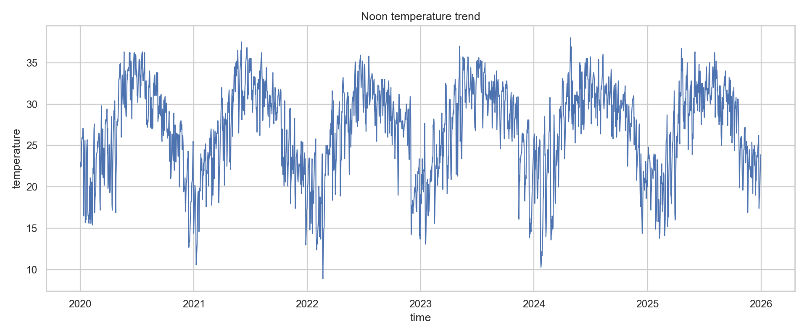

Biểu đồ xu hướng nhiệt độ cho thấy chu kỳ mùa vụ rõ rệt qua các năm. Nhiệt độ tăng trong các tháng nóng và giảm trong các giai đoạn lạnh. Đây là cơ sở để đưa các đặc trưng thời gian như `month`, `season` và `day_of_year` vào mô hình.

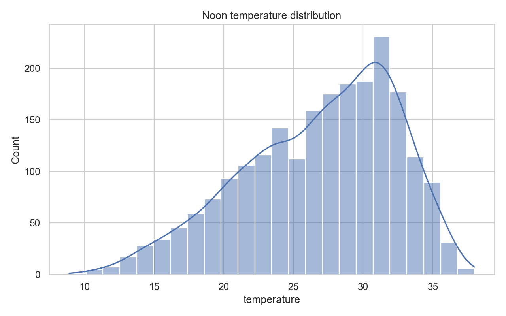

Phân phối nhiệt độ cho thấy phần lớn quan sát tập trung quanh vùng nhiệt độ trung bình đến nóng, phù hợp với đặc điểm khí hậu Hà Nội.

## 4.2. Correlation heatmap

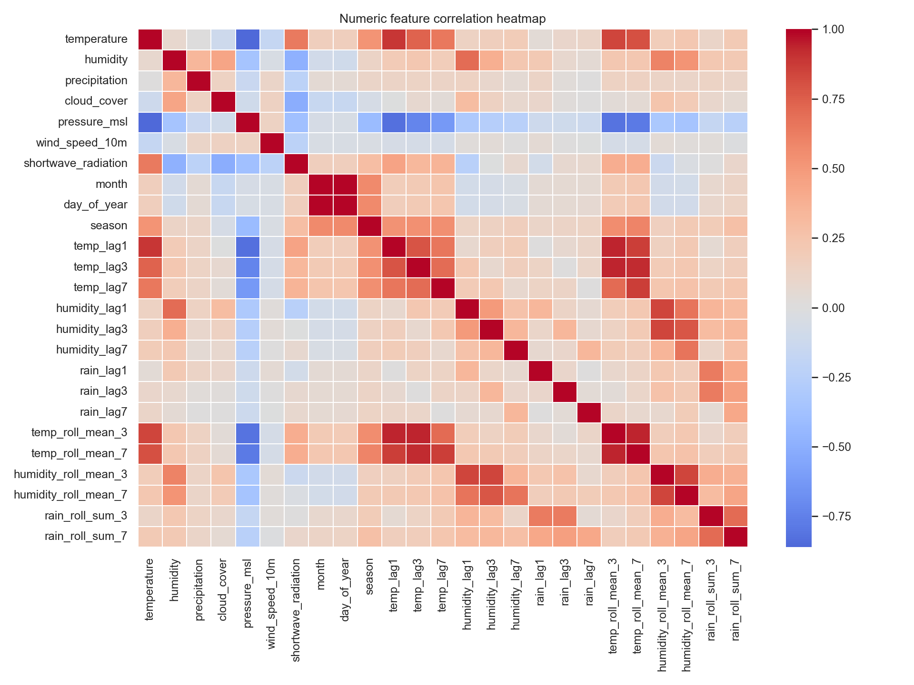

Correlation heatmap mô tả quan hệ tuyến tính giữa các biến. Các đặc trưng nhiệt độ hiện tại, nhiệt độ lag và rolling temperature có tương quan cao. Điều này phù hợp với bản chất vật lý của nhiệt độ: trạng thái nhiệt hôm nay thường chịu ảnh hưởng mạnh từ những ngày gần trước đó. Tuy nhiên, tương quan cao cũng đặt ra vấn đề đa cộng tuyến khi diễn giải hệ số Linear Regression. Do đó, hệ số tuyến tính và feature importance cần được hiểu như tín hiệu mô hình, không nên diễn giải trực tiếp như quan hệ nhân quả.

## 4.3. PCA

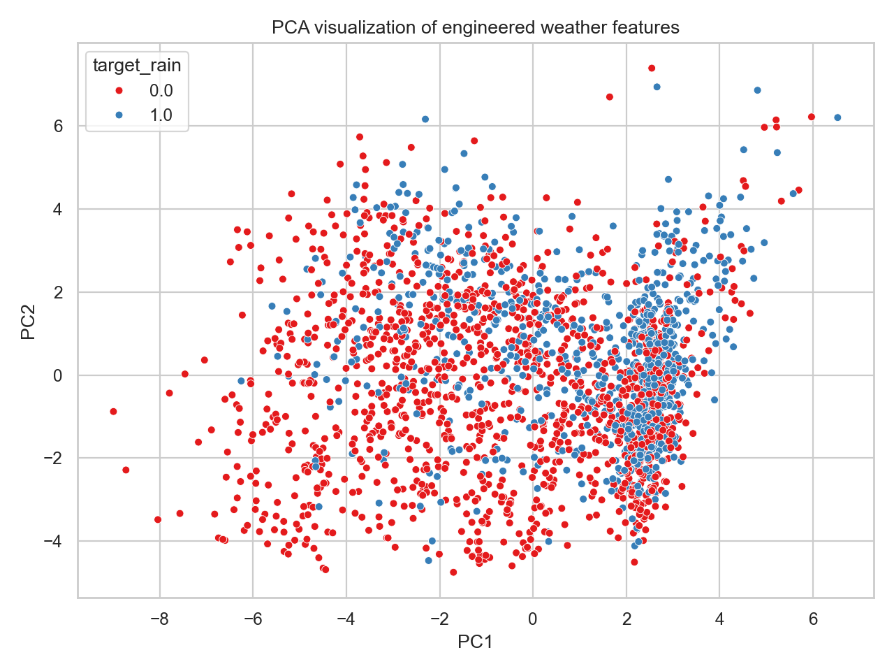

PCA giảm không gian đặc trưng nhiều chiều xuống hai thành phần chính PC1 và PC2. Các giá trị trên trục PCA như -4, -2, 0, 2, 4 là tọa độ trong không gian mới sau phép biến đổi tuyến tính, không còn mang đơn vị khí tượng gốc như °C, mm hay hPa. Nếu các điểm mưa và không mưa chồng lấn nhiều trong không gian PCA, điều đó cho thấy bài toán phân loại mưa khó tách bằng một ranh giới đơn giản trong hai chiều biểu diễn chính.

# 5. Thiết kế thực nghiệm

## 5.1. Chia train, validation và test

Dữ liệu được chia theo thứ tự thời gian thay vì chia ngẫu nhiên:

| Tập dữ liệu | Giai đoạn | Vai trò |
|---|---|---|
| Training | 2020-2023 | Huấn luyện trọng số và tuning tham số bằng TimeSeriesSplit |
| Validation | 2024 | Chọn model cuối và chọn threshold mưa |
| Test | 2025 | Đánh giá cuối cùng trên dữ liệu chưa dùng để chọn |

Chia theo thời gian là bắt buộc trong bài toán dự báo vì mô hình chỉ được học từ quá khứ để dự đoán tương lai. Nếu chia ngẫu nhiên, dữ liệu tương lai có thể xuất hiện trong training set, làm kết quả đánh giá bị lạc quan giả tạo.

## 5.2. Baseline

Hai baseline được sử dụng làm mốc so sánh:

- Temperature baseline: dự báo nhiệt độ ngày mai bằng nhiệt độ hôm nay. Đây là persistence baseline, phù hợp với tính liên tục của nhiệt độ.
- Rain baseline: luôn dự báo lớp phổ biến nhất trong training set, tương đương `DummyClassifier(strategy="most_frequent")`.

Baseline không phải là mô hình học máy phức tạp. Vai trò của baseline là kiểm tra xem các mô hình học máy có thực sự tạo thêm giá trị so với chiến lược dự báo đơn giản hay không.

## 5.3. Mô hình

Nhóm hồi quy nhiệt độ gồm:

- Linear Regression.
- KNN Regressor.
- XGBoost Regressor.

Nhóm phân loại mưa gồm:

- Logistic Regression với `class_weight='balanced'`.
- SVM với `class_weight='balanced'`.
- XGBoost Classifier với `scale_pos_weight` tự động theo tỷ lệ lớp.

Các mô hình nhạy với thang đo như Linear Regression, Logistic Regression, SVM và KNN được kết hợp với `StandardScaler`. XGBoost là mô hình cây nên không yêu cầu chuẩn hóa đặc trưng.

# 6. Hyperparameter tuning và threshold tuning

Hyperparameter tuning được thực hiện bằng `RandomizedSearchCV` kết hợp `TimeSeriesSplit(n_splits=5)` trên training set. `TimeSeriesSplit` giữ đúng thứ tự thời gian: mỗi fold huấn luyện trên một đoạn quá khứ và kiểm tra trên đoạn tương lai ngay sau đó. Điều này phù hợp với bản chất chuỗi thời gian hơn KFold ngẫu nhiên.

Ở bài toán hồi quy, cấu hình tốt nhất được chọn theo negative RMSE trong cross-validation. Khi báo cáo, giá trị này được đổi dấu thành mean CV RMSE, trong đó thấp hơn là tốt hơn. Ở bài toán phân loại, cấu hình tốt nhất được chọn theo F1 trong cross-validation, trong đó cao hơn là tốt hơn.

Linear Regression không có hyperparameter tuning trong pipeline hiện tại vì mô hình được fit bằng ordinary least squares sau chuẩn hóa. KNN tune `n_neighbors` và `weights`. XGBoost tune `n_estimators`, `max_depth` và `learning_rate`. Logistic Regression tune `C`. SVM tune `C` và `kernel`.

Sau khi mô hình phân loại sinh xác suất mưa, pipeline không sử dụng cố định threshold 0,5. Threshold được thử từ 0,10 đến 0,90 với bước 0,05 trên validation set; threshold tốt nhất là threshold tối đa hóa F1 validation. Như vậy, nhóm classification có hai lớp tuning: tuning tham số mô hình trên training cross-validation và tuning ngưỡng quyết định trên validation set.

# 7. Kết quả dự báo ngày kế tiếp

## 7.1. Hồi quy nhiệt độ

Kết quả validation:

| Mô hình | MAE | RMSE | R2 |
|---|---:|---:|---:|
| Linear Regression | 1,811 | 2,375 | 0,814 |
| KNN Regressor | 2,214 | 2,761 | 0,749 |
| XGBoost Regressor | 1,893 | 2,439 | 0,804 |

Kết quả test:

| Mô hình | MAE | RMSE | R2 |
|---|---:|---:|---:|
| Linear Regression | 1,674 | 2,319 | 0,808 |
| KNN Regressor | 2,148 | 2,821 | 0,716 |
| XGBoost Regressor | 1,830 | 2,432 | 0,789 |

Linear Regression được chọn vì có RMSE thấp nhất trên validation set. Trên test set, mô hình này tiếp tục đạt RMSE thấp nhất và R2 cao nhất. Kết quả này cho thấy dự báo nhiệt độ ngày kế tiếp lúc 12:00 có cấu trúc tương đối tuyến tính, trong đó nhiệt độ hiện tại, đặc trưng mùa vụ, lag và rolling đã chứa phần lớn tín hiệu dự báo.

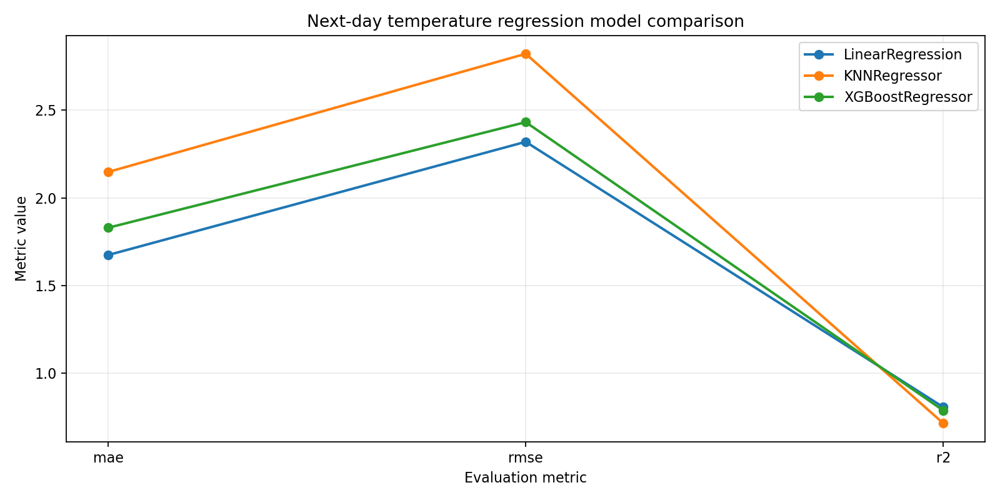

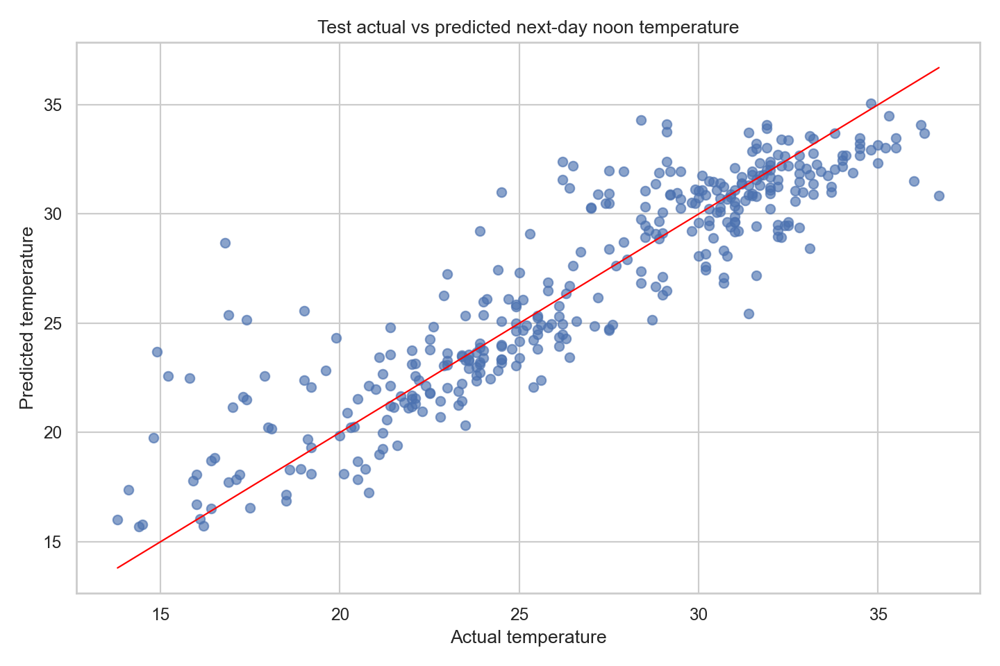

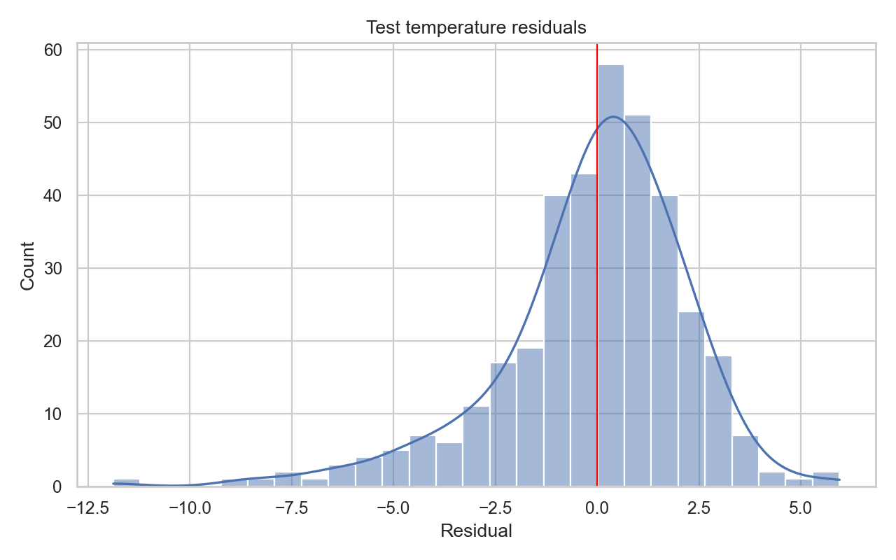

Đối với hồi quy, không nên đánh giá đúng/sai tuyệt đối như phân loại. Vì vậy, báo cáo dùng thêm các ngưỡng sai số:

| Tập dữ liệu | MAE | RMSE | Trong ±1°C | Trong ±2°C | Trong ±3°C |
|---|---:|---:|---:|---:|---:|
| Validation | 1,811 | 2,375 | 0,388 | 0,653 | 0,806 |
| Test | 1,674 | 2,319 | 0,420 | 0,692 | 0,849 |

Trên test set, khoảng 69,2% dự báo nằm trong sai số ±2°C và 84,9% nằm trong ±3°C. Đây là kết quả hợp lý với một hệ thống sử dụng dữ liệu lịch sử tại một điểm không gian.

## 7.2. Trọng số w và hệ số chặn b của Linear Regression

Đối với Linear Regression, quá trình huấn luyện không tìm kiếm hyperparameter như `n_neighbors`, `max_depth` hay `learning_rate`. Thay vào đó, mô hình ước lượng trực tiếp bộ trọng số `w` và hệ số chặn `b` bằng cách cực tiểu hóa hàm mất mát bình phương sai số trên training set. Công thức dự báo có dạng:

```text
y_hat = w1*x1 + w2*x2 + ... + wn*xn + b
```

Trong đó `x1 ... xn` là các đặc trưng đầu vào sau chuẩn hóa, `w1 ... wn` là các hệ số tuyến tính học được, và `b` là hệ số chặn của mô hình. Vì pipeline sử dụng `StandardScaler` trước Linear Regression, các hệ số `w` được diễn giải trong không gian đặc trưng đã chuẩn hóa. Do đó, độ lớn của hệ số cho biết mức đóng góp tương đối của đặc trưng sau chuẩn hóa, không phải mức thay đổi trực tiếp theo đơn vị gốc như °C, mm hay hPa.

Các hệ số có độ lớn cao nhất trong mô hình nhiệt độ ngày kế tiếp gồm:

| Đặc trưng | Hệ số w | Hướng tác động |
|---|---:|---|
| temperature | 4,485 | positive |
| day_of_year | -1,007 | negative |
| temp_lag1 | -0,881 | negative |
| month | 0,851 | positive |
| temp_lag7 | 0,540 | positive |
| humidity | 0,391 | positive |
| temp_roll_mean_3 | 0,285 | positive |
| pressure_msl | -0,267 | negative |
| temp_lag3 | 0,214 | positive |
| season | 0,208 | positive |

Hệ số dương nghĩa là khi đặc trưng đó tăng trong không gian đã chuẩn hóa, dự báo nhiệt độ có xu hướng tăng nếu các đặc trưng khác giữ nguyên. Hệ số âm nghĩa là đặc trưng đó có quan hệ ngược chiều với nhiệt độ dự báo trong mô hình tuyến tính. Ví dụ, hệ số của `temperature` lớn và dương cho thấy nhiệt độ hiện tại là tín hiệu mạnh nhất cho nhiệt độ ngày kế tiếp. Các đặc trưng mùa vụ như `day_of_year`, `month` và `season` cũng có hệ số đáng kể, phản ánh chu kỳ khí hậu theo năm.

Điểm cần nhấn mạnh là `w` và `b` không phải là “tham số tuned tốt nhất” theo nghĩa hyperparameter tuning. Chúng là tham số mô hình được học trực tiếp từ dữ liệu training. Bảng đầy đủ các hệ số được lưu trong `reports/tables/linear_regression_coefficients.csv`, còn biểu đồ hệ số được trình bày ở phần diễn giải mô hình.

## 7.3. Phân loại mưa

Kết quả validation:

| Mô hình | Accuracy | Precision | Recall | F1 | ROC AUC |
|---|---:|---:|---:|---:|---:|
| Logistic Regression | 0,653 | 0,532 | 0,712 | 0,609 | 0,742 |
| SVM | 0,680 | 0,560 | 0,741 | 0,638 | 0,758 |
| XGBoost Classifier | 0,686 | 0,574 | 0,669 | 0,618 | 0,751 |

Kết quả test:

| Mô hình | Accuracy | Precision | Recall | F1 | ROC AUC |
|---|---:|---:|---:|---:|---:|
| Logistic Regression | 0,720 | 0,612 | 0,783 | 0,687 | 0,785 |
| SVM | 0,717 | 0,616 | 0,741 | 0,673 | 0,774 |
| XGBoost Classifier | 0,698 | 0,611 | 0,636 | 0,623 | 0,767 |

SVM được chọn vì có F1 cao nhất trên validation set. Trên test set, Logistic Regression có F1 cao hơn SVM, nhưng lựa chọn mô hình sau khi nhìn test set sẽ vi phạm quy trình đánh giá. Do đó, SVM vẫn là mô hình được chọn hợp lệ theo nguyên tắc validation-first.

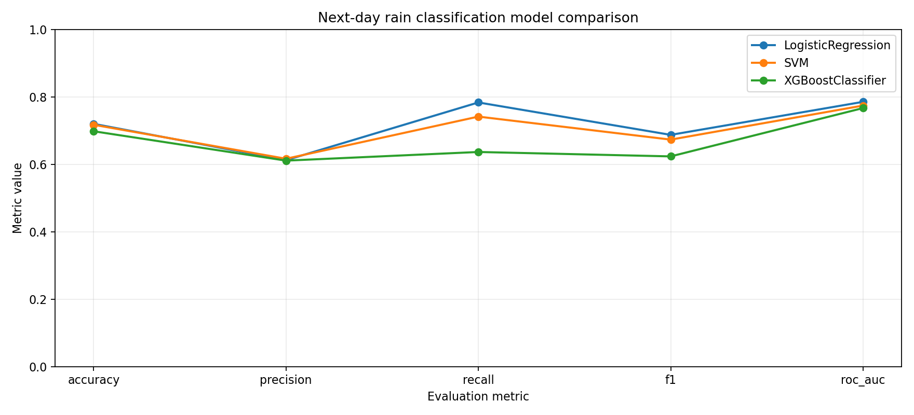

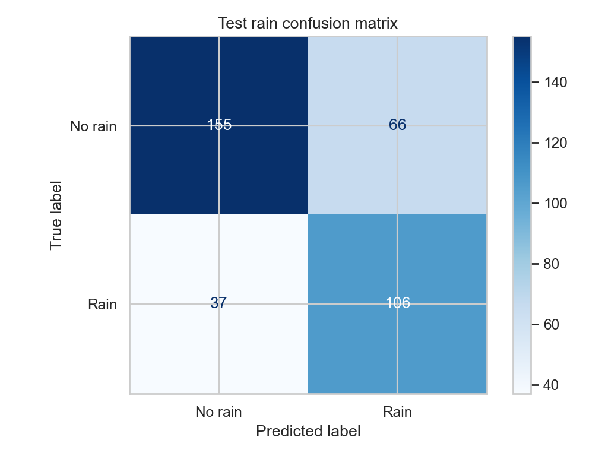

Confusion matrix cho biết mô hình dự báo đúng/sai ở từng lớp. False negative nghĩa là thực tế có mưa nhưng mô hình dự báo không mưa; false positive nghĩa là thực tế không mưa nhưng mô hình dự báo có mưa. Tùy ứng dụng, false negative có thể nghiêm trọng hơn vì người dùng không chuẩn bị cho mưa.

## 7.4. Thí nghiệm A/B với shortwave radiation

| Thí nghiệm | Dùng shortwave | Best regression | Validation RMSE | Test RMSE | Best rain | Validation F1 | Test F1 |
|---|---:|---|---:|---:|---|---:|---:|
| A_without_shortwave_radiation | False | Linear Regression | 2,374 | 2,317 | SVM | 0,652 | 0,660 |
| B_with_shortwave_radiation | True | Linear Regression | 2,375 | 2,319 | SVM | 0,638 | 0,673 |

Đối với nhiệt độ, thêm `shortwave_radiation` không cải thiện rõ rệt; RMSE gần như không đổi. Đối với mưa, không dùng shortwave tốt hơn trên validation nhưng dùng shortwave tốt hơn trên test. Điều này cho thấy biến shortwave có thể chứa tín hiệu khí tượng, nhưng tác động của nó chưa ổn định giữa các năm.

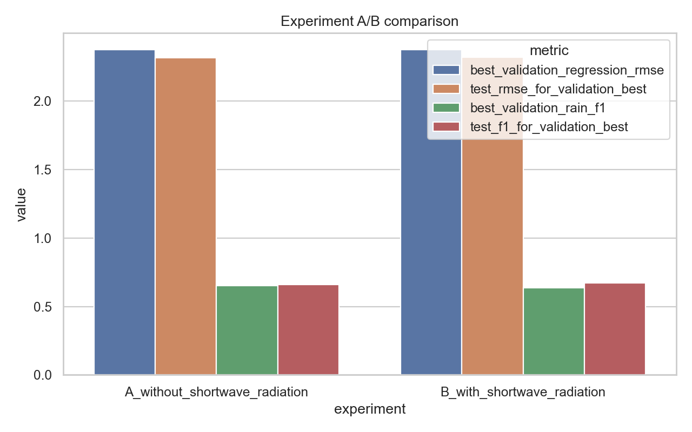

# 8. Kết quả dự báo 7 ngày

## 8.1. Thiết kế direct multi-horizon

Với mỗi horizon `h = 1..7`, target được định nghĩa:

```text
horizon_temperature = temperature.shift(-h)
horizon_rain = precipitation.shift(-h) > 0
```

Đây là direct multi-horizon forecasting. Mỗi horizon có một cặp mô hình riêng cho nhiệt độ và mưa. Cách này tránh lỗi tích lũy của phương pháp recursive, nhưng cần huấn luyện nhiều mô hình hơn.

## 8.2. Phiên bản n_iter=4

| Horizon | Mô hình nhiệt độ | RMSE test | Mô hình mưa | F1 test | Threshold mưa |
|---:|---|---:|---|---:|---:|
| 1 | LinearRegression | 2,319 | XGBoostClassifier | 0,652 | 0,20 |
| 2 | LinearRegression | 3,010 | LogisticRegression | 0,653 | 0,40 |
| 3 | XGBoostRegressor | 3,436 | LogisticRegression | 0,638 | 0,45 |
| 4 | XGBoostRegressor | 3,682 | LogisticRegression | 0,617 | 0,40 |
| 5 | XGBoostRegressor | 3,747 | LogisticRegression | 0,587 | 0,50 |
| 6 | XGBoostRegressor | 3,422 | LogisticRegression | 0,597 | 0,40 |
| 7 | XGBoostRegressor | 3,417 | SVM | 0,634 | 0,40 |

Sai số nhiệt độ tăng khi horizon dài hơn. Đây là xu hướng phù hợp với lý thuyết dự báo: dự báo càng xa hiện tại thì độ bất định càng lớn. Với mưa, F1 dao động quanh 0,587-0,653, cho thấy bài toán mưa 7 ngày khó hơn do tính thưa và biến động nhanh của sự kiện mưa.

## 8.3. Phiên bản n_iter=20

| Horizon | Mô hình nhiệt độ | RMSE validation | RMSE test | Mô hình mưa | F1 validation | F1 test | Threshold |
|---:|---|---:|---:|---|---:|---:|---:|
| 1 | XGBoostRegressor | 2,375 | 2,358 | XGBoostClassifier | 0,672 | 0,678 | 0,35 |
| 2 | XGBoostRegressor | 3,100 | 3,061 | LogisticRegression | 0,668 | 0,653 | 0,40 |
| 3 | XGBoostRegressor | 3,337 | 3,283 | LogisticRegression | 0,647 | 0,638 | 0,45 |
| 4 | XGBoostRegressor | 3,459 | 3,415 | LogisticRegression | 0,641 | 0,617 | 0,40 |
| 5 | XGBoostRegressor | 3,436 | 3,512 | LogisticRegression | 0,628 | 0,587 | 0,50 |
| 6 | XGBoostRegressor | 3,458 | 3,262 | XGBoostClassifier | 0,615 | 0,620 | 0,45 |
| 7 | XGBoostRegressor | 3,516 | 3,220 | SVM | 0,620 | 0,634 | 0,40 |

Trong phiên bản `n_iter=20`, XGBoostRegressor được chọn cho toàn bộ 7 horizon nhiệt độ. Điều này cho thấy khi dự báo xa hơn một ngày, quan hệ giữa input hiện tại/quá khứ và nhiệt độ tương lai không còn tuyến tính đơn giản như bài toán ngày kế tiếp. XGBoost có khả năng mô hình hóa tương tác phi tuyến giữa mùa, độ ẩm, mây, bức xạ, lag và rolling, nên phù hợp hơn với bài toán đa horizon.

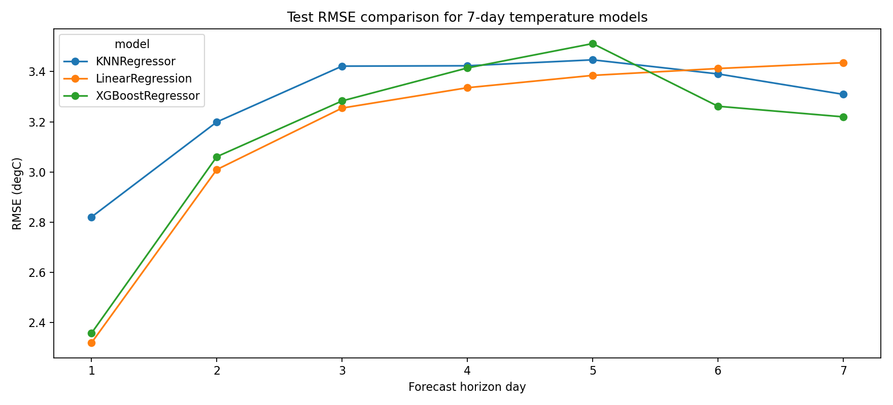

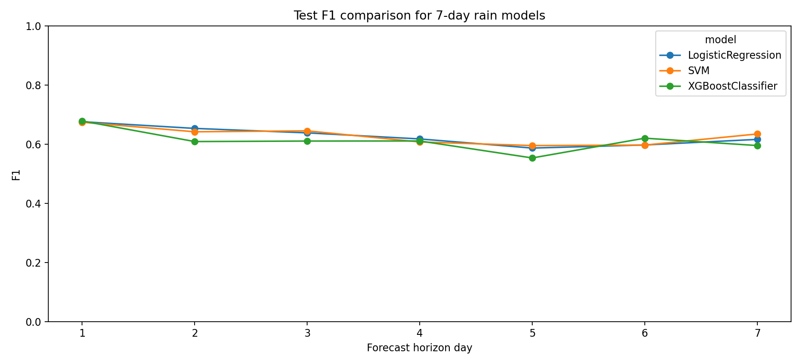

## 8.4. So sánh n_iter=4 và n_iter=20

| Chỉ số | n_iter=4 | n_iter=20 | Diễn giải |
|---|---:|---:|---|
| Mean selected temperature test RMSE | 3,290 | 3,159 | Thấp hơn là tốt hơn |
| Mean selected rain test F1 | 0,625 | 0,632 | Cao hơn là tốt hơn |

| Horizon | RMSE n_iter=4 | RMSE n_iter=20 | Delta RMSE | F1 n_iter=4 | F1 n_iter=20 | Delta F1 |
|---:|---:|---:|---:|---:|---:|---:|
| 1 | 2,319 | 2,358 | +0,039 | 0,652 | 0,678 | +0,026 |
| 2 | 3,010 | 3,061 | +0,051 | 0,653 | 0,653 | 0,000 |
| 3 | 3,436 | 3,283 | -0,153 | 0,638 | 0,638 | 0,000 |
| 4 | 3,682 | 3,415 | -0,267 | 0,617 | 0,617 | 0,000 |
| 5 | 3,747 | 3,512 | -0,235 | 0,587 | 0,587 | 0,000 |
| 6 | 3,422 | 3,262 | -0,160 | 0,597 | 0,620 | +0,023 |
| 7 | 3,417 | 3,220 | -0,198 | 0,634 | 0,634 | 0,000 |

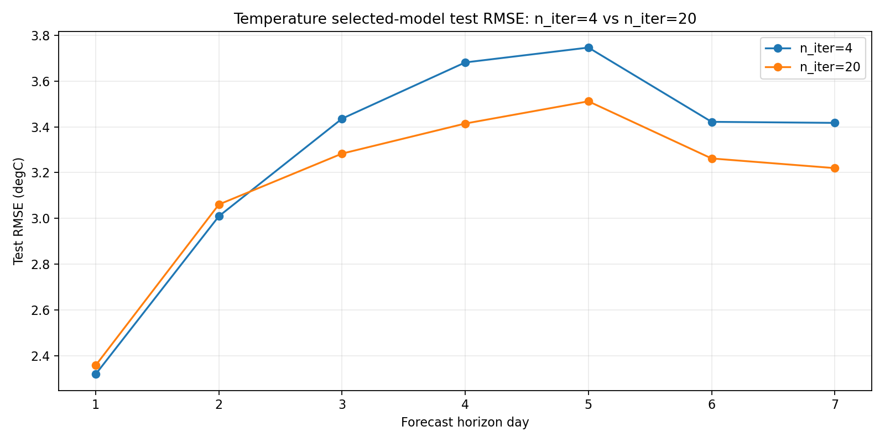

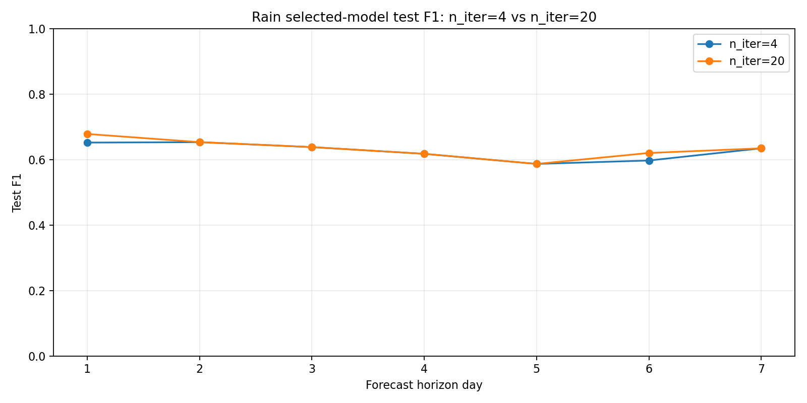

Phiên bản `n_iter=20` không tốt hơn ở mọi horizon. Ở horizon 1 và 2, RMSE nhiệt độ tăng nhẹ. Tuy nhiên, từ horizon 3 đến 7, RMSE giảm rõ hơn, làm RMSE trung bình toàn bộ 7 ngày thấp hơn. Với mưa, cải thiện tập trung ở horizon 1 và 6; các horizon khác gần như không đổi. Như vậy, tuning sâu hơn có ích nhưng không phải yếu tố duy nhất quyết định chất lượng dự báo.

# 9. Tham số tốt nhất và diễn giải tuning

## 9.1. Tham số tốt nhất của phiên bản n_iter=20

| Horizon | Task | Model | CV metric | Best params |
|---:|---|---|---:|---|
| 1 | temperature | XGBoostRegressor | RMSE 2,896 | learning_rate=0,01597; max_depth=4; n_estimators=443 |
| 1 | rain | XGBoostClassifier | F1 0,638 | learning_rate=0,01597; max_depth=4; n_estimators=443 |
| 2 | temperature | XGBoostRegressor | RMSE 3,546 | learning_rate=0,01597; max_depth=4; n_estimators=443 |
| 2 | rain | LogisticRegression | F1 0,579 | C=0,01 |
| 3 | temperature | XGBoostRegressor | RMSE 3,988 | learning_rate=0,01597; max_depth=4; n_estimators=443 |
| 3 | rain | LogisticRegression | F1 0,562 | C=0,01 |
| 4 | temperature | XGBoostRegressor | RMSE 4,138 | learning_rate=0,01597; max_depth=4; n_estimators=443 |
| 4 | rain | LogisticRegression | F1 0,546 | C=0,01 |
| 5 | temperature | XGBoostRegressor | RMSE 4,004 | learning_rate=0,12177; max_depth=4; n_estimators=152 |
| 5 | rain | LogisticRegression | F1 0,562 | C=0,01 |
| 6 | temperature | XGBoostRegressor | RMSE 3,952 | learning_rate=0,01597; max_depth=4; n_estimators=443 |
| 6 | rain | XGBoostClassifier | F1 0,507 | learning_rate=0,01597; max_depth=4; n_estimators=443 |
| 7 | temperature | XGBoostRegressor | RMSE 3,837 | learning_rate=0,01597; max_depth=4; n_estimators=443 |
| 7 | rain | SVM | F1 0,549 | C=0,1; kernel=linear |

Bảng trên trình bày cấu hình tốt nhất trong search space của model được chọn tại từng horizon. Cần phân biệt hai giai đoạn: `RandomizedSearchCV` chọn cấu hình tốt nhất cho từng model trên training cross-validation; sau đó validation set chọn model cuối cùng giữa các candidate model đã được tuning.

## 9.2. Biểu đồ hyperparameter tuning từng model

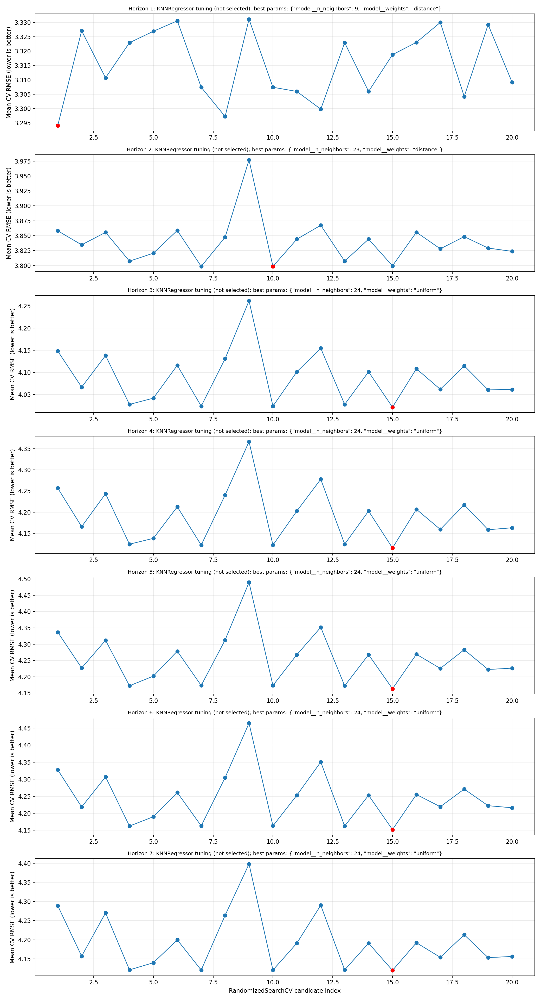

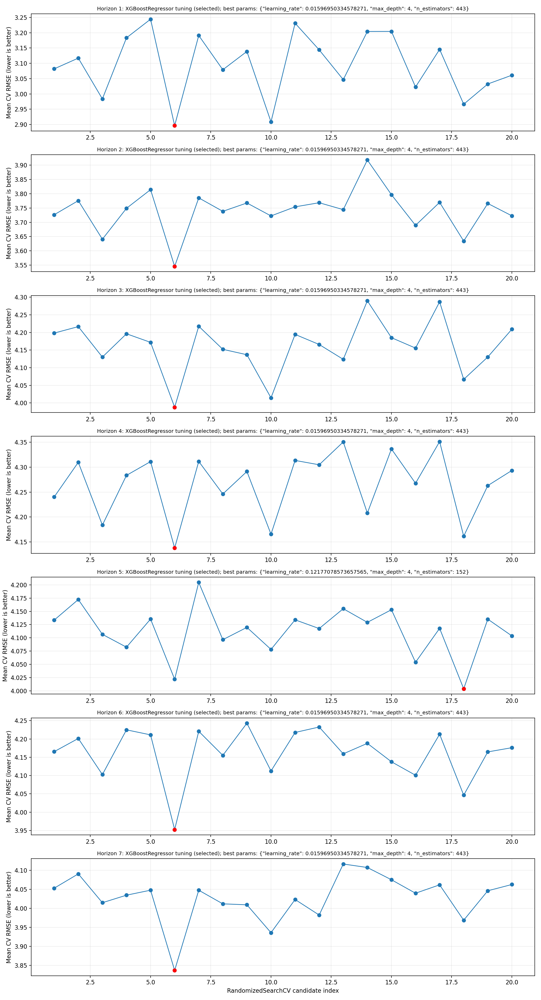

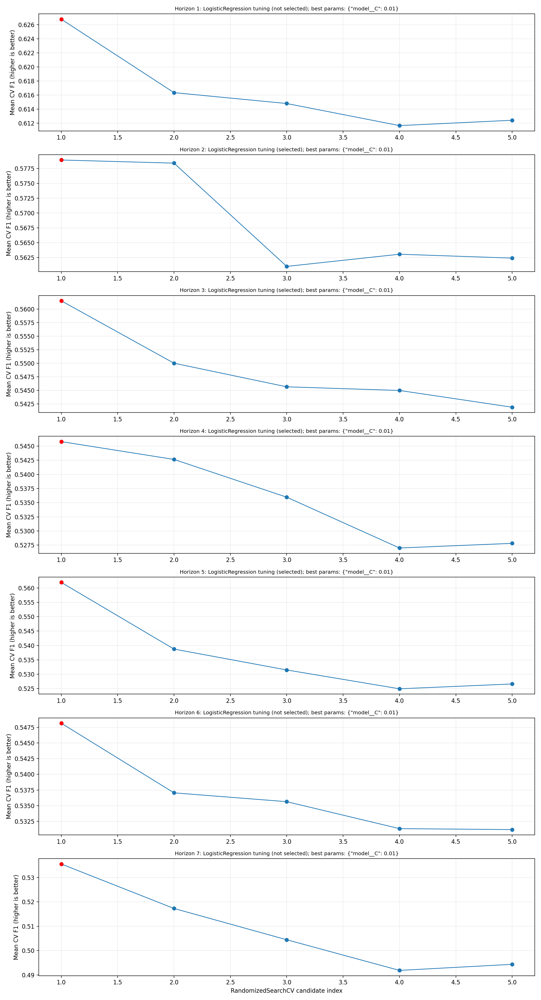

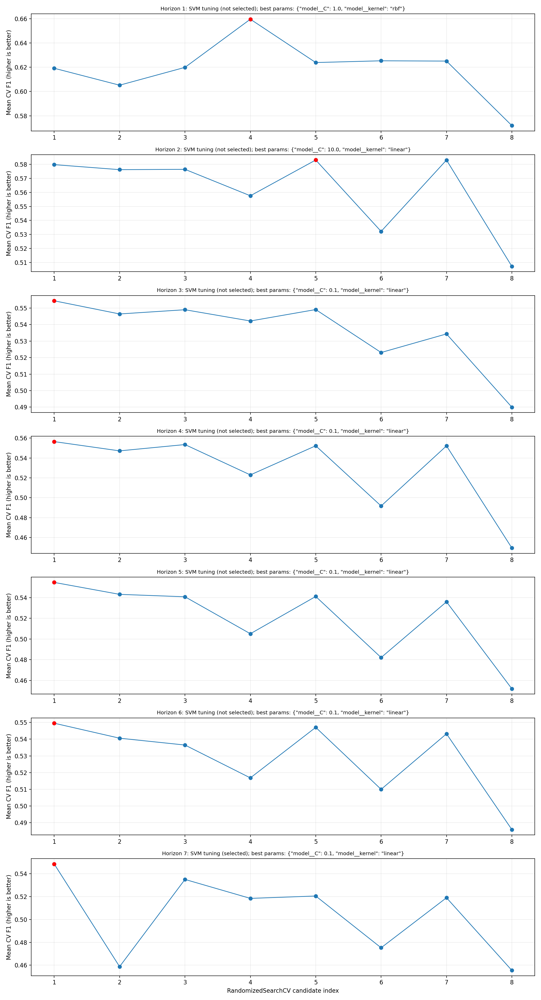

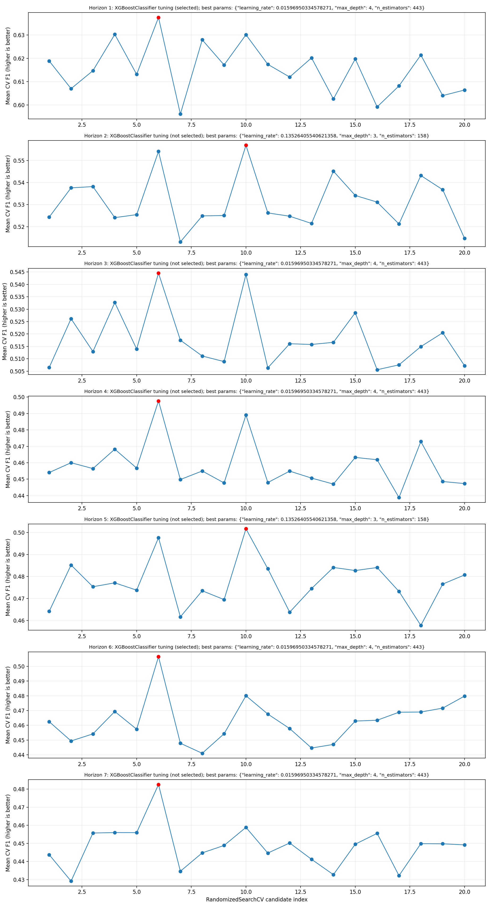

Các biểu đồ này cho thấy mỗi điểm tương ứng một cấu hình được thử bởi `RandomizedSearchCV`. Với hồi quy, trục tung là CV RMSE nên càng thấp càng tốt. Với phân loại, trục tung là CV F1 nên càng cao càng tốt. Việc so sánh đường tuning giúp thấy rõ model nào nhạy với cấu hình tham số và model nào ổn định hơn.

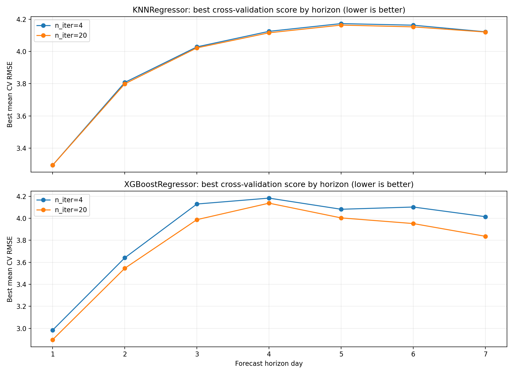

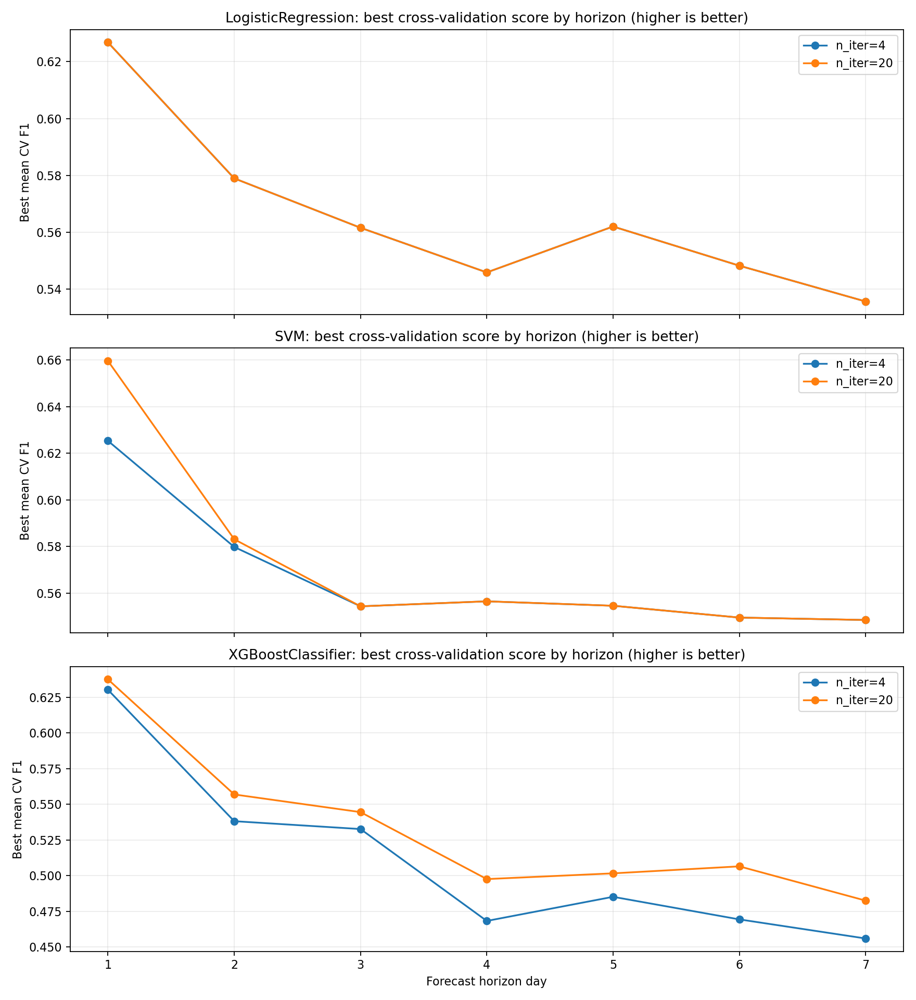

Với các model có search space nhỏ như Logistic Regression và SVM, tăng `n_iter` có thể nhanh chóng chạm giới hạn số cấu hình khả dụng. Với XGBoost, search space lớn hơn nhiều; do đó `n_iter=20` có cơ hội tìm được cấu hình cây tốt hơn so với `n_iter=4`.

# 10. Complexity / Running Time của quá trình huấn luyện

Để đánh giá chi phí tính toán của pipeline 7 ngày, báo cáo đo thời gian huấn luyện thực tế cho hai cấu hình `RandomizedSearchCV`: `n_iter=4` và `n_iter=20`. Phép đo được thực hiện trên cùng dữ liệu, cùng cách chia train/validation/test và cùng tập mô hình. Thời gian dưới đây là thời gian huấn luyện model, không bao gồm thời gian viết báo cáo, lưu hình hoặc xuất DOCX.

Với các mô hình dùng `RandomizedSearchCV`, số lần fit ước lượng được tính theo công thức:

```text
estimated_fit_count = effective_n_iter * n_splits + 1
```

Trong đó `n_splits = 5` là số fold của `TimeSeriesSplit`, `effective_n_iter` là số cấu hình thực sự được thử, và `+1` là lần refit cuối cùng trên toàn bộ training set. Với Linear Regression, mô hình không tuning hyperparameter nên số lần fit chỉ là 1 cho mỗi horizon.

Tổng chi phí huấn luyện của toàn bộ pipeline 7 ngày:

| n_iter | Tổng thời gian train | Tổng số lần fit ước lượng |
|---:|---:|---:|
| 4 | 155,775 giây | 742 |
| 20 | 565,846 giây | 2.597 |

Khi tăng từ `n_iter=4` lên `n_iter=20`, tổng số lần fit tăng khoảng 3,50 lần, từ 742 lên 2.597. Tổng thời gian train thực tế tăng khoảng 3,63 lần, từ 155,775 giây lên 565,846 giây. Điều này phù hợp với bản chất của `RandomizedSearchCV`: thử nhiều cấu hình hơn giúp tăng khả năng tìm được bộ tham số tốt, nhưng chi phí tính toán tăng gần tuyến tính theo số cấu hình cần đánh giá, đặc biệt với các mô hình cây như XGBoost.

Chi phí huấn luyện theo từng nhóm mô hình:

| Task | Model | Time n_iter=4 | Time n_iter=20 | Fit count n_iter=4 | Fit count n_iter=20 |
|---|---|---:|---:|---:|---:|
| temperature_regression | LinearRegression | 0,020 giây | 0,022 giây | 7 | 7 |
| temperature_regression | KNNRegressor | 1,472 giây | 3,507 giây | 147 | 707 |
| temperature_regression | XGBoostRegressor | 92,950 giây | 254,669 giây | 147 | 707 |
| rain_classification | LogisticRegression | 3,805 giây | 2,873 giây | 147 | 182 |
| rain_classification | SVM | 22,866 giây | 201,067 giây | 147 | 287 |
| rain_classification | XGBoostClassifier | 34,663 giây | 103,710 giây | 147 | 707 |

Linear Regression gần như không bị ảnh hưởng bởi `n_iter` vì không có hyperparameter tuning. KNN có số lần fit tăng mạnh nhưng thời gian vẫn thấp do mô hình nhỏ và dữ liệu không quá lớn. XGBoostRegressor là thành phần tốn thời gian nhất trong nhóm nhiệt độ vì mỗi cấu hình phải xây dựng nhiều cây quyết định. Trong nhóm mưa, SVM tăng thời gian rõ rệt khi `n_iter=20` vì số cấu hình hiệu dụng tăng và việc tính xác suất với `probability=True` làm quá trình fit nặng hơn. Logistic Regression có search space rời rạc nhỏ; do đó thời gian không tăng tuyến tính và có thể dao động nhẹ giữa hai lần đo.

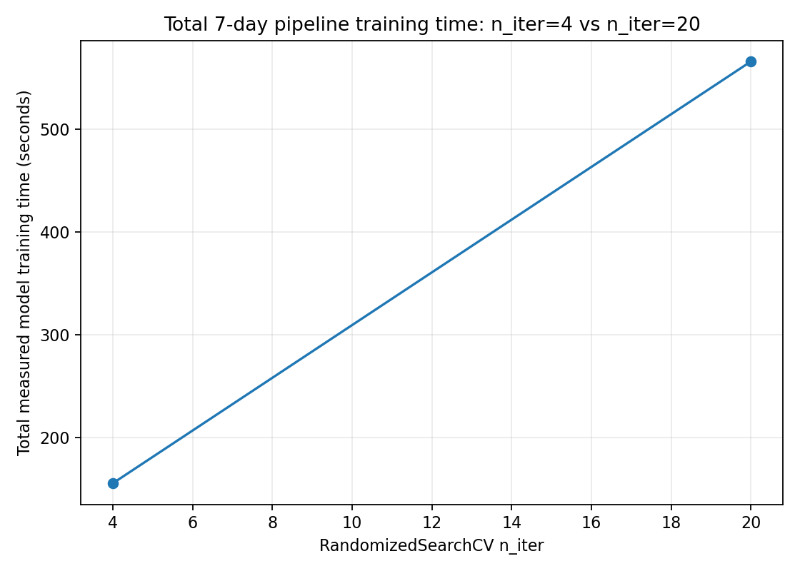

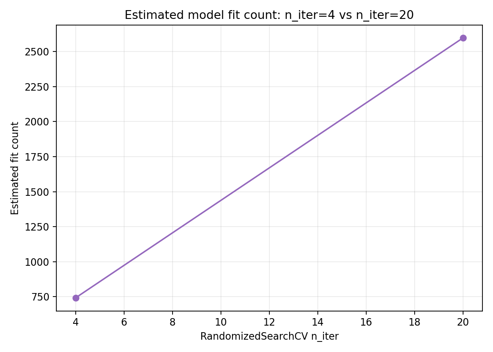

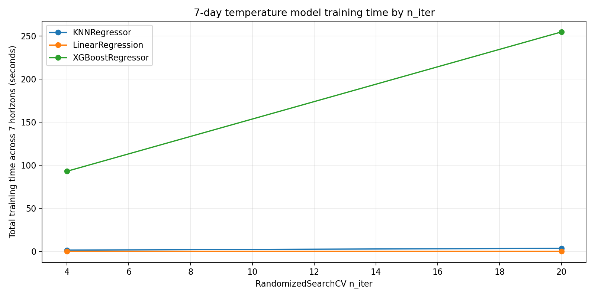

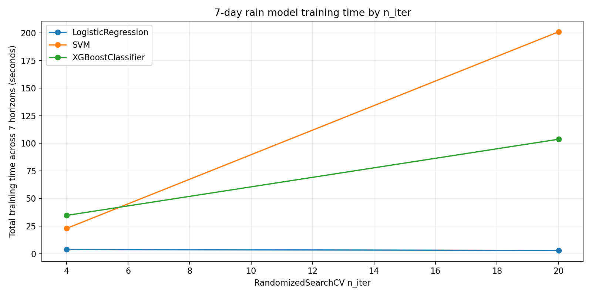

Về mặt đánh đổi, phiên bản `n_iter=20` cải thiện RMSE trung bình của nhiệt độ từ 3,290 xuống 3,159 và cải thiện F1 trung bình của mưa từ 0,625 lên 0,632, nhưng thời gian huấn luyện tăng từ khoảng 2,60 phút lên 9,43 phút. Do đó, `n_iter=20` phù hợp hơn cho báo cáo học thuật và đánh giá cuối cùng, còn `n_iter=4` phù hợp hơn cho thử nghiệm nhanh hoặc kiểm tra pipeline.

# 11. Kết quả suy luận 7 ngày tương lai

Kết quả dự báo được sinh từ bản ghi 12:00 mới nhất trong dữ liệu, tức 2025-12-30 12:00. Bảy ngày dự báo cụ thể là từ 2025-12-31 đến 2026-01-06.

| Ngày dự báo | Mô hình nhiệt độ | Nhiệt độ dự báo | Mô hình mưa | Xác suất mưa | Threshold | Nhãn mưa | Mức thời tiết |
|---|---|---:|---|---:|---:|---|---|
| 2025-12-31 | XGBoostRegressor | 22,951 | XGBoostClassifier | 0,314 | 0,35 | no_rain | normal |
| 2026-01-01 | XGBoostRegressor | 20,880 | LogisticRegression | 0,229 | 0,40 | no_rain | cool |
| 2026-01-02 | XGBoostRegressor | 20,150 | LogisticRegression | 0,241 | 0,45 | no_rain | cool |
| 2026-01-03 | XGBoostRegressor | 18,374 | LogisticRegression | 0,268 | 0,40 | no_rain | cool |
| 2026-01-04 | XGBoostRegressor | 16,657 | LogisticRegression | 0,261 | 0,50 | no_rain | cool |
| 2026-01-05 | XGBoostRegressor | 17,840 | XGBoostClassifier | 0,127 | 0,45 | no_rain | cool |
| 2026-01-06 | XGBoostRegressor | 18,283 | SVM | 0,285 | 0,40 | no_rain | cool |

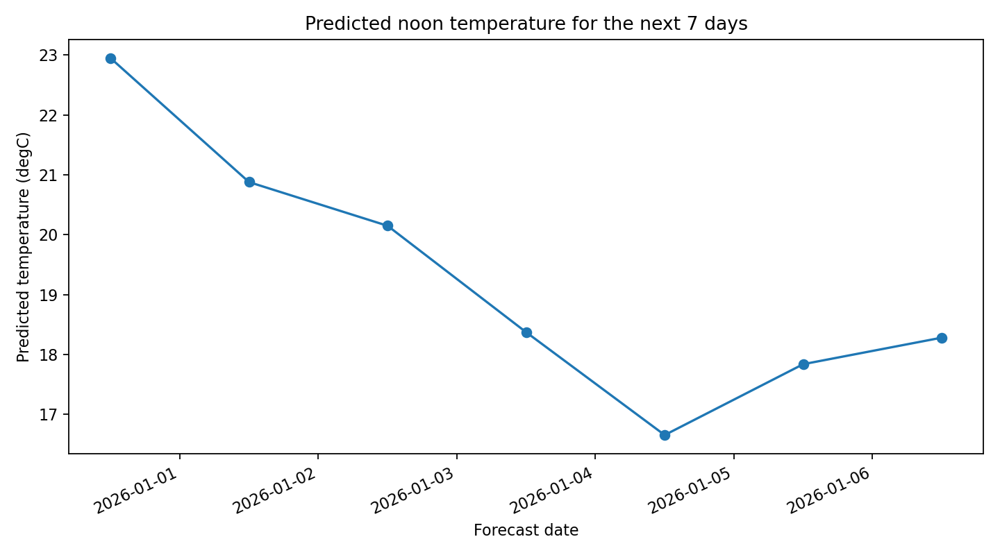

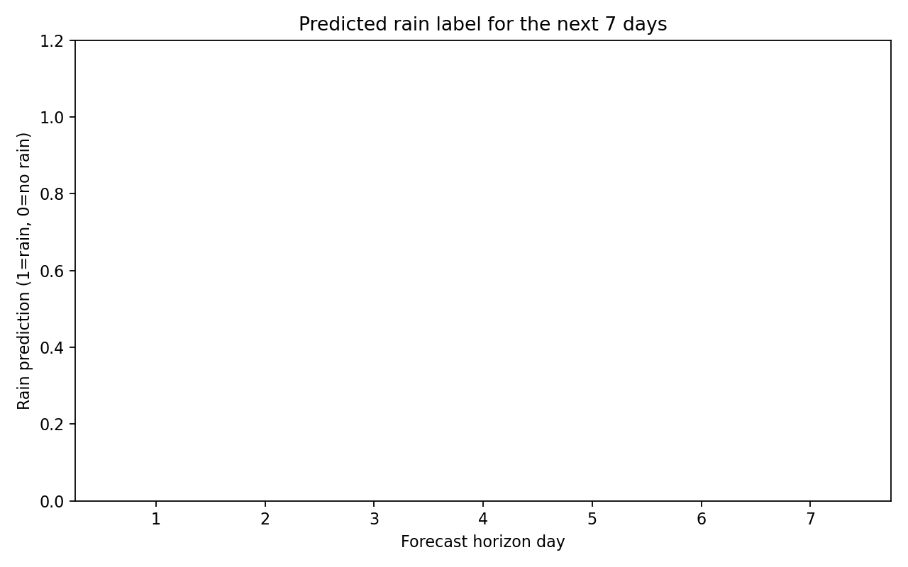

Mô hình dự báo toàn bộ 7 ngày là không mưa tại thời điểm 12:00 vì xác suất mưa đều thấp hơn threshold đã chọn. Nhiệt độ dự báo chuyển từ mức normal ở ngày đầu sang cool ở các ngày tiếp theo.

# 12. Đánh giá actual-predicted trên test set


Biểu đồ nhiệt độ actual-predicted trên toàn bộ test set năm 2025 cho thấy mô hình bám được xu hướng mùa vụ và dao động chính của nhiệt độ. Sai lệch tăng ở các horizon xa, phù hợp với nguyên lý dự báo: càng xa hiện tại, độ bất định càng lớn.


Biểu đồ mưa actual-predicted cho thấy mô hình phân loại mưa còn sai đáng kể. Điều này phù hợp với F1 ở mức trung bình, vì mưa là sự kiện thưa và khó tách. Để cải thiện đáng kể bài toán mưa, cần thêm dữ liệu dự báo khí tượng tương lai, dữ liệu nhiều thời điểm trong ngày hoặc dữ liệu không gian từ khu vực lân cận.

# 13. Feature importance và diễn giải mô hình

Feature importance cần được hiểu theo từng loại mô hình. Với Linear Regression và Logistic Regression, hệ số sau chuẩn hóa cho biết chiều và độ mạnh tương đối của ảnh hưởng tuyến tính. Với XGBoost, importance phản ánh mức độ đặc trưng được dùng trong các cây để giảm lỗi. Với KNN và SVM, permutation importance đo mức suy giảm hiệu năng khi tráo một đặc trưng.

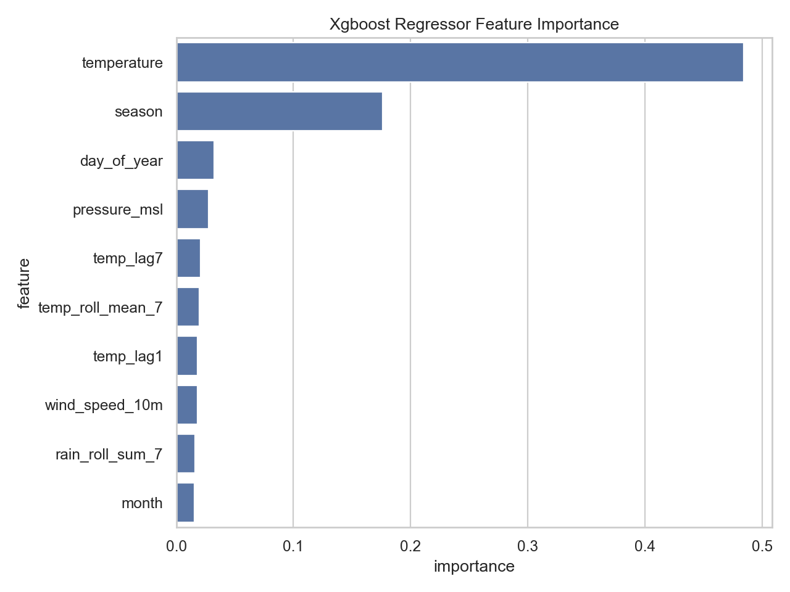

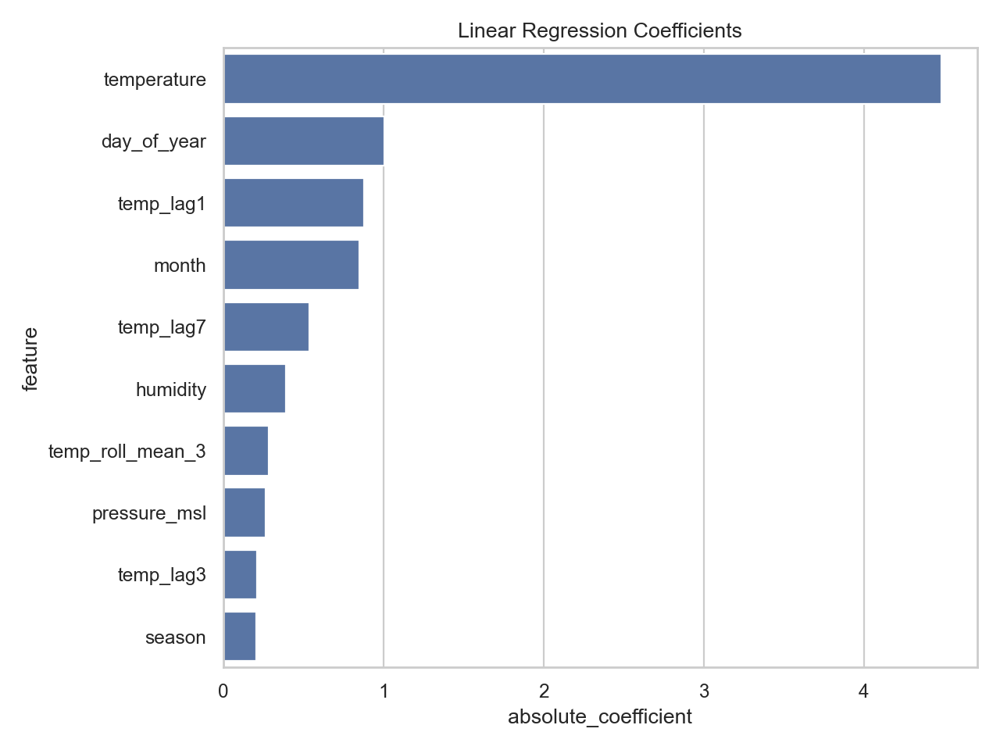

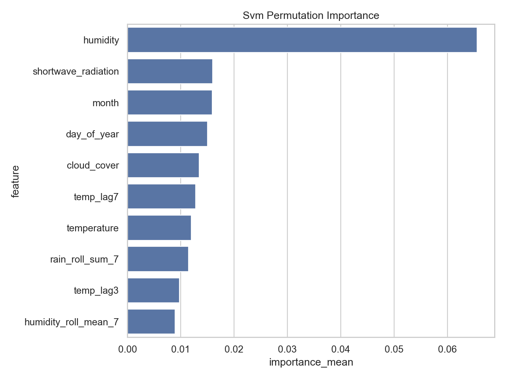

Feature importance không phản ánh model nào là tốt nhất. Chất lượng mô hình phải được đánh giá bằng các metric trên validation/test như RMSE, MAE, R2, F1 và ROC AUC. Feature importance chỉ trả lời câu hỏi mô hình đang dựa nhiều vào đặc trưng nào trong quá trình ra quyết định.

# 14. Diễn giải các chỉ số đánh giá

MAE là sai số tuyệt đối trung bình. Với nhiệt độ, MAE 1,674 nghĩa là trung bình dự báo lệch khoảng 1,674°C so với thực tế. MAE dễ hiểu nhưng không phạt mạnh các lỗi lớn.

RMSE là căn bậc hai của sai số bình phương trung bình. RMSE phạt các lỗi lớn mạnh hơn MAE; vì vậy RMSE thấp hơn nghĩa là mô hình ít mắc các lỗi dự báo lệch xa.

R2 đo tỷ lệ phương sai của biến mục tiêu được mô hình giải thích. R2 gần 1 là tốt; R2 gần 0 nghĩa là mô hình không tốt hơn nhiều so với việc dự báo bằng giá trị trung bình. Trong dự báo 7 ngày, R2 giảm khi horizon dài hơn là hiện tượng hợp lý.

Within ±1°C, ±2°C và ±3°C cho biết tỷ lệ dự báo nằm trong một khoảng sai số chấp nhận được. Chỉ số này hữu ích hơn cách nói đúng/sai tuyệt đối trong hồi quy vì nhiệt độ là biến liên tục.

Accuracy là tỷ lệ dự báo đúng tổng thể trong phân loại mưa. Precision cho biết trong các lần mô hình dự báo mưa, bao nhiêu lần thực sự có mưa. Recall cho biết trong các ngày thực sự có mưa, mô hình phát hiện được bao nhiêu. F1 là trung bình điều hòa giữa precision và recall, phù hợp khi dữ liệu mất cân bằng. ROC AUC đo khả năng xếp hạng xác suất giữa lớp mưa và không mưa.

# 15. Thảo luận học thuật

Kết quả thực nghiệm cho thấy bài toán nhiệt độ dễ dự báo hơn bài toán mưa. Nguyên nhân chính là nhiệt độ có tính liên tục theo thời gian và chịu ảnh hưởng mạnh của mùa vụ. Ngược lại, mưa là hiện tượng cục bộ, rời rạc và chịu ảnh hưởng của nhiều yếu tố khí quyển mà dữ liệu một điểm lúc 12:00 không thể mô tả đầy đủ.

Trong bài toán ngày kế tiếp, Linear Regression đạt kết quả tốt nhất cho nhiệt độ. Điều này không có nghĩa Linear Regression luôn mạnh hơn XGBoost, mà phản ánh rằng với horizon ngắn và tập dữ liệu hiện có, quan hệ tuyến tính đã đủ hiệu quả. Trong bài toán 7 ngày, XGBoostRegressor chiếm ưu thế vì dự báo xa hơn yêu cầu mô hình hóa quan hệ phi tuyến và tương tác đặc trưng phức tạp hơn.

Việc tăng `n_iter` từ 4 lên 20 làm rõ vai trò của hyperparameter tuning. Khi chỉ thử 4 cấu hình, kết quả có thể phụ thuộc mạnh vào các mẫu ngẫu nhiên ban đầu. Khi thử 20 cấu hình, xác suất tìm được cấu hình phù hợp hơn tăng lên, đặc biệt với XGBoost. Tuy nhiên, tăng `n_iter` không bảo đảm mọi horizon đều tốt hơn vì validation/test có thể khác phân phối, và mô hình được chọn theo validation không được tối ưu trực tiếp trên test.

Đối với mưa, tuning threshold là cần thiết. Nếu dùng threshold mặc định 0,5, mô hình có thể quá bảo thủ và dự báo nhiều ngày không mưa. Threshold tối ưu theo validation set giúp cân bằng precision và recall theo F1. Tuy nhiên, threshold tuning chỉ điều chỉnh quyết định đầu ra, không thay thế được việc cần thêm đặc trưng khí tượng mạnh hơn.

# 16. Hạn chế

Thứ nhất, dữ liệu chỉ sử dụng một điểm không gian là Hà Nội và chỉ lấy thời điểm 12:00. Điều này làm bài toán rõ ràng nhưng mất thông tin về diễn biến theo giờ và cấu trúc không gian của thời tiết.

Thứ hai, pipeline dự báo 7 ngày dùng direct multi-horizon từ bản ghi hiện tại, không tự sinh toàn bộ chuỗi biến khí hậu tương lai như độ ẩm, áp suất, gió, mây hay bức xạ. Vì vậy, mô hình đang học quan hệ từ trạng thái hiện tại/quá khứ sang target tương lai, chứ không mô phỏng khí quyển đầy đủ.

Thứ ba, test set chỉ là năm 2025. Mặc dù đánh giá này đúng quy trình, kết quả vẫn có thể chịu ảnh hưởng bởi đặc điểm riêng của năm đó. Nhiều năm test hơn sẽ giúp kết luận ổn định hơn.

Thứ tư, bài toán mưa được chuyển thành nhị phân `precipitation > 0`. Trong thực tế, mưa rất nhỏ và mưa đáng kể có ý nghĩa sử dụng khác nhau. Một hướng cải thiện là dự báo nhiều mức mưa hoặc dự báo lượng mưa liên tục rồi suy ra nhãn.

# 17. Kết luận và hướng phát triển

Dự án đã xây dựng thành công pipeline học máy cho dự báo thời tiết Hà Nội lúc 12:00, bao gồm dự báo ngày kế tiếp và dự báo 7 ngày. Hệ thống thực hiện đầy đủ các bước của một quy trình học máy học thuật: tiền xử lý dữ liệu, phân tích thống kê, trực quan hóa, tạo đặc trưng không rò rỉ dữ liệu, chia train/validation/test theo thời gian, tuning tham số bằng `TimeSeriesSplit`, lựa chọn mô hình bằng validation set, đánh giá cuối trên test set và sinh báo cáo kết quả.

Với bài toán ngày kế tiếp, Linear Regression là mô hình tốt nhất cho nhiệt độ với RMSE test 2,319°C và R2 0,808. Với bài toán mưa ngày kế tiếp, SVM được chọn theo validation F1 và đạt F1 test 0,673. Với bài toán dự báo 7 ngày, phiên bản `n_iter=20` là phiên bản thuyết phục hơn vì cải thiện RMSE trung bình của nhiệt độ từ 3,290 xuống 3,159 và F1 trung bình của mưa từ 0,625 lên 0,632.

Trong tương lai, hệ thống có thể được cải thiện bằng cách bổ sung dữ liệu nhiều thời điểm trong ngày, dữ liệu không gian từ các khu vực lân cận, biến khí tượng dự báo từ mô hình số trị, hoặc dữ liệu ảnh mây/radar. Ngoài ra, có thể thử các mô hình chuỗi thời gian như LSTM, Temporal Convolutional Network hoặc Transformer, nhưng cần đánh giá cẩn thận để tránh overfitting trên tập dữ liệu còn tương đối nhỏ.
