# Hanoi 7-Day Noon Weather Forecasting Report

## Introduction
This report presents an extended version of the original Hanoi noon weather prediction system. Instead of predicting only the next day, this version predicts noon temperature and rain for the next 7 days. The problem is formulated as a multi-horizon supervised learning task.

## Motivation
Short-term weather forecasting is useful for planning travel, outdoor work, school activities, and daily scheduling. A 7-day forecast is more practical than a single next-day prediction because users often need to plan several days ahead. However, forecasting difficulty increases with horizon length because future atmospheric conditions become less certain.

## Contribution
This version contributes a separate 7-day forecasting pipeline with the following components:

- Multi-horizon target generation for day 1 to day 7.
- Temperature regression model for each horizon.
- Rain classification model for each horizon.
- Chronological train/validation/test evaluation.
- Horizon-wise metrics and figures.
- Final 7-day forecast output from the latest available noon observation.

## Project Objective
The objective is to predict Hanoi weather at 12:00 PM for each of the next 7 days.

The two machine learning tasks are:

- Temperature regression: predict noon temperature at horizon `h`, where `h = 1..7`.
- Rain classification: predict whether noon precipitation at horizon `h` is greater than 0.

Weather level is not trained as a separate model. It is derived from predicted temperature:

```text
temperature < 22      -> cool
22 <= temperature <=30 -> normal
temperature > 30      -> hot
```

## Dataset
- Raw hourly records: 52,608
- Noon records: 2,192
- Engineered supervised samples before horizon-specific target filtering: 2,191
- Latest available noon record used for next-7-day inference: 2025-12-30 12:00:00

The data contains historical Open-Meteo observations from 2020 to 2025. Only records at 12:00 are used to keep the forecasting target consistent with the project objective.

## Dataset Statistics

| index | temperature | humidity | precipitation | cloud_cover | pressure_msl | wind_speed_10m | shortwave_radiation |
| --- | --- | --- | --- | --- | --- | --- | --- |
| count | 2192.0 | 2192.0 | 2192.0 | 2192.0 | 2192.0 | 2192.0 | 2192.0 |
| mean | 26.906 | 67.167 | 0.255 | 77.693 | 1011.833 | 9.766 | 547.39 |
| std | 5.497 | 12.306 | 0.957 | 33.656 | 7.343 | 5.027 | 235.568 |
| min | 8.9 | 22.0 | 0.0 | 0.0 | 990.5 | 0.0 | 59.0 |
| 25% | 23.2 | 60.0 | 0.0 | 61.0 | 1005.7 | 5.9 | 346.75 |
| 50% | 27.8 | 68.0 | 0.0 | 99.0 | 1011.3 | 9.3 | 568.5 |
| 75% | 31.125 | 76.0 | 0.1 | 100.0 | 1017.6 | 13.0 | 753.0 |
| max | 38.0 | 96.0 | 13.8 | 100.0 | 1032.3 | 38.0 | 949.0 |

The average noon temperature is about 26.9°C, while precipitation has a median of 0.0 mm. This indicates that rainfall is sparse at noon, making rain classification more difficult than temperature regression.

## Input and Expected Output
Input:

```text
Historical 12:00 weather records with engineered lag, rolling, and time features.
```

Outputs:

```text
For each horizon h = 1..7:
- predicted noon temperature
- predicted rain / no rain label
- derived weather level
```

## Data Preprocessing
The preprocessing logic follows the original project:

1. Detect and remove Open-Meteo metadata rows.
2. Normalize weather column names.
3. Parse the `time` column as datetime.
4. Sort observations chronologically.
5. Remove duplicated timestamps.
6. Keep only records where `hour == 12`.
7. Remove unused or leakage-prone columns.
8. Fill numeric missing values with medians if needed.

## Feature Engineering
The 7-day pipeline reuses the same feature engineering design as the original system:

- Time features: `month`, `day_of_year`, `season`.
- Lag features for temperature, humidity, and precipitation at lags 1, 3, and 7.
- Rolling features using shifted rolling windows.

Rolling features are computed with `shift(1)` before `rolling()`. This is important because the model must not use information from the day being predicted.

## Methodology
For each horizon `h = 1..7`, the target is generated as:

```text
horizon_temperature = temperature.shift(-h)
horizon_rain = precipitation.shift(-h) > 0
```

This means that horizon 1 predicts tomorrow, horizon 2 predicts two days later, and so on until horizon 7.

The same input feature set is used for each horizon, but each horizon has its own target and its own trained model pair. This direct multi-horizon approach avoids recursive error accumulation.

## Train / Validation / Test Protocol
The data is split chronologically:

| Split | Period | Role |
|---|---|---|
| Training | 2020-2023 | Fit model parameters |
| Validation | 2024 | Check model behavior and compare horizons |
| Test | 2025 | Final evaluation |

The test set is not used to train or select models. This preserves a realistic evaluation on unseen future data.

## Model Training Process
This version trains and compares multiple candidate models for each horizon:

Temperature regression candidates:

- Linear Regression.
- KNN Regressor.
- XGBoost Regressor.

Rain classification candidates:

- Logistic Regression with balanced class weights.
- SVM with balanced class weights.
- XGBoost Classifier with automatic `scale_pos_weight`.

For each horizon, the temperature model uses a pipeline:

```text
StandardScaler -> LinearRegression / KNN
XGBoostRegressor without scaling
```

Linear Regression is fitted directly after scaling. KNN and XGBoost are tuned with `RandomizedSearchCV` and `TimeSeriesSplit`.

For rain classification, the model uses:

```text
StandardScaler -> LogisticRegression / SVM
XGBoostClassifier without scaling
```

The best temperature model for each horizon is selected by validation RMSE. The best rain model for each horizon is selected by validation F1. Test metrics are reported only after model selection.

## Selected Models by Horizon

| horizon_day | best_temperature_model | validation_rmse | test_rmse | best_rain_model | validation_f1 | test_f1 | rain_threshold |
| --- | --- | --- | --- | --- | --- | --- | --- |
| 1 | LinearRegression | 2.375 | 2.319 | XGBoostClassifier | 0.665 | 0.652 | 0.2 |
| 2 | LinearRegression | 3.21 | 3.01 | LogisticRegression | 0.668 | 0.653 | 0.4 |
| 3 | XGBoostRegressor | 3.452 | 3.436 | LogisticRegression | 0.647 | 0.638 | 0.45 |
| 4 | XGBoostRegressor | 3.558 | 3.682 | LogisticRegression | 0.641 | 0.617 | 0.4 |
| 5 | XGBoostRegressor | 3.603 | 3.747 | LogisticRegression | 0.628 | 0.587 | 0.5 |
| 6 | XGBoostRegressor | 3.571 | 3.422 | LogisticRegression | 0.614 | 0.597 | 0.4 |
| 7 | XGBoostRegressor | 3.661 | 3.417 | SVM | 0.62 | 0.634 | 0.4 |

## Validation Performance by Horizon

### Temperature Model Comparison on Validation Set

| horizon_day | model | mae | rmse | r2 | within_1c | within_2c | within_3c |
| --- | --- | --- | --- | --- | --- | --- | --- |
| 1 | LinearRegression | 1.811 | 2.375 | 0.814 | 0.388 | 0.653 | 0.806 |
| 1 | KNNRegressor | 2.214 | 2.761 | 0.749 | 0.257 | 0.536 | 0.757 |
| 1 | XGBoostRegressor | 1.893 | 2.439 | 0.804 | 0.322 | 0.617 | 0.798 |
| 2 | LinearRegression | 2.481 | 3.21 | 0.661 | 0.262 | 0.495 | 0.683 |
| 2 | KNNRegressor | 2.6 | 3.362 | 0.627 | 0.257 | 0.456 | 0.667 |
| 2 | XGBoostRegressor | 2.52 | 3.29 | 0.643 | 0.292 | 0.511 | 0.686 |
| 3 | LinearRegression | 2.786 | 3.622 | 0.564 | 0.227 | 0.432 | 0.639 |
| 3 | KNNRegressor | 2.781 | 3.626 | 0.563 | 0.24 | 0.454 | 0.623 |
| 3 | XGBoostRegressor | 2.623 | 3.452 | 0.604 | 0.24 | 0.478 | 0.683 |
| 4 | LinearRegression | 2.924 | 3.815 | 0.516 | 0.227 | 0.429 | 0.593 |
| 4 | KNNRegressor | 2.807 | 3.678 | 0.55 | 0.243 | 0.459 | 0.62 |
| 4 | XGBoostRegressor | 2.694 | 3.558 | 0.579 | 0.268 | 0.478 | 0.642 |
| 5 | LinearRegression | 2.975 | 3.92 | 0.489 | 0.227 | 0.432 | 0.596 |
| 5 | KNNRegressor | 2.798 | 3.718 | 0.54 | 0.254 | 0.456 | 0.642 |
| 5 | XGBoostRegressor | 2.794 | 3.603 | 0.568 | 0.254 | 0.462 | 0.612 |
| 6 | LinearRegression | 3.004 | 3.973 | 0.475 | 0.238 | 0.437 | 0.596 |
| 6 | KNNRegressor | 2.82 | 3.728 | 0.538 | 0.262 | 0.448 | 0.626 |
| 6 | XGBoostRegressor | 2.736 | 3.571 | 0.576 | 0.251 | 0.47 | 0.648 |
| 7 | LinearRegression | 3.022 | 3.985 | 0.472 | 0.232 | 0.44 | 0.579 |
| 7 | KNNRegressor | 2.863 | 3.731 | 0.537 | 0.224 | 0.448 | 0.601 |
| 7 | XGBoostRegressor | 2.812 | 3.661 | 0.554 | 0.26 | 0.456 | 0.637 |

### Rain Model Comparison on Validation Set

| horizon_day | model | accuracy | precision | recall | f1 |
| --- | --- | --- | --- | --- | --- |
| 1 | LogisticRegression | 0.639 | 0.515 | 0.892 | 0.653 |
| 1 | SVM | 0.631 | 0.508 | 0.863 | 0.64 |
| 1 | XGBoostClassifier | 0.669 | 0.541 | 0.863 | 0.665 |
| 2 | LogisticRegression | 0.645 | 0.516 | 0.949 | 0.668 |
| 2 | SVM | 0.648 | 0.518 | 0.935 | 0.667 |
| 2 | XGBoostClassifier | 0.579 | 0.471 | 0.928 | 0.624 |
| 3 | LogisticRegression | 0.639 | 0.511 | 0.883 | 0.647 |
| 3 | SVM | 0.637 | 0.509 | 0.832 | 0.632 |
| 3 | XGBoostClassifier | 0.604 | 0.483 | 0.847 | 0.615 |
| 4 | LogisticRegression | 0.596 | 0.48 | 0.964 | 0.641 |
| 4 | SVM | 0.664 | 0.536 | 0.766 | 0.631 |
| 4 | XGBoostClassifier | 0.522 | 0.437 | 0.956 | 0.6 |
| 5 | LogisticRegression | 0.65 | 0.522 | 0.788 | 0.628 |
| 5 | SVM | 0.623 | 0.498 | 0.81 | 0.617 |
| 5 | XGBoostClassifier | 0.59 | 0.47 | 0.745 | 0.576 |
| 6 | LogisticRegression | 0.557 | 0.454 | 0.949 | 0.614 |
| 6 | SVM | 0.612 | 0.487 | 0.816 | 0.61 |
| 6 | XGBoostClassifier | 0.522 | 0.43 | 0.875 | 0.576 |
| 7 | LogisticRegression | 0.642 | 0.51 | 0.785 | 0.618 |
| 7 | SVM | 0.661 | 0.529 | 0.748 | 0.62 |
| 7 | XGBoostClassifier | 0.525 | 0.43 | 0.889 | 0.58 |

## Test Performance by Horizon

### Temperature Model Comparison on Test Set

| horizon_day | model | mae | rmse | r2 | within_1c | within_2c | within_3c |
| --- | --- | --- | --- | --- | --- | --- | --- |
| 1 | LinearRegression | 1.674 | 2.319 | 0.808 | 0.42 | 0.692 | 0.849 |
| 1 | KNNRegressor | 2.148 | 2.821 | 0.716 | 0.288 | 0.555 | 0.769 |
| 1 | XGBoostRegressor | 1.83 | 2.432 | 0.789 | 0.368 | 0.657 | 0.835 |
| 2 | LinearRegression | 2.289 | 3.01 | 0.677 | 0.284 | 0.567 | 0.725 |
| 2 | KNNRegressor | 2.46 | 3.211 | 0.633 | 0.253 | 0.526 | 0.705 |
| 2 | XGBoostRegressor | 2.449 | 3.177 | 0.64 | 0.292 | 0.493 | 0.683 |
| 3 | LinearRegression | 2.497 | 3.255 | 0.624 | 0.271 | 0.517 | 0.691 |
| 3 | KNNRegressor | 2.627 | 3.413 | 0.586 | 0.26 | 0.481 | 0.638 |
| 3 | XGBoostRegressor | 2.655 | 3.436 | 0.58 | 0.229 | 0.472 | 0.657 |
| 4 | LinearRegression | 2.609 | 3.336 | 0.605 | 0.26 | 0.479 | 0.632 |
| 4 | KNNRegressor | 2.685 | 3.43 | 0.583 | 0.271 | 0.457 | 0.645 |
| 4 | XGBoostRegressor | 2.86 | 3.682 | 0.519 | 0.197 | 0.418 | 0.643 |
| 5 | LinearRegression | 2.669 | 3.385 | 0.594 | 0.256 | 0.467 | 0.644 |
| 5 | KNNRegressor | 2.691 | 3.454 | 0.578 | 0.267 | 0.458 | 0.622 |
| 5 | XGBoostRegressor | 2.856 | 3.747 | 0.503 | 0.244 | 0.453 | 0.633 |
| 6 | LinearRegression | 2.68 | 3.412 | 0.588 | 0.226 | 0.468 | 0.643 |
| 6 | KNNRegressor | 2.629 | 3.398 | 0.592 | 0.281 | 0.462 | 0.655 |
| 6 | XGBoostRegressor | 2.61 | 3.422 | 0.586 | 0.262 | 0.493 | 0.655 |
| 7 | LinearRegression | 2.711 | 3.435 | 0.583 | 0.257 | 0.45 | 0.64 |
| 7 | KNNRegressor | 2.565 | 3.329 | 0.609 | 0.268 | 0.508 | 0.656 |
| 7 | XGBoostRegressor | 2.694 | 3.417 | 0.588 | 0.246 | 0.475 | 0.645 |

Temperature error increases as the horizon becomes longer. This is expected because the model predicts further into the future with the same historical input information.

### Rain Model Comparison on Test Set

| horizon_day | model | accuracy | precision | recall | f1 |
| --- | --- | --- | --- | --- | --- |
| 1 | LogisticRegression | 0.665 | 0.545 | 0.888 | 0.676 |
| 1 | SVM | 0.61 | 0.502 | 0.79 | 0.614 |
| 1 | XGBoostClassifier | 0.659 | 0.545 | 0.811 | 0.652 |
| 2 | LogisticRegression | 0.628 | 0.516 | 0.888 | 0.653 |
| 2 | SVM | 0.631 | 0.519 | 0.874 | 0.651 |
| 2 | XGBoostClassifier | 0.565 | 0.471 | 0.846 | 0.605 |
| 3 | LogisticRegression | 0.63 | 0.52 | 0.825 | 0.638 |
| 3 | SVM | 0.644 | 0.532 | 0.818 | 0.645 |
| 3 | XGBoostClassifier | 0.58 | 0.481 | 0.783 | 0.596 |
| 4 | LogisticRegression | 0.584 | 0.486 | 0.846 | 0.617 |
| 4 | SVM | 0.634 | 0.528 | 0.713 | 0.607 |
| 4 | XGBoostClassifier | 0.504 | 0.437 | 0.874 | 0.583 |
| 5 | LogisticRegression | 0.608 | 0.505 | 0.699 | 0.587 |
| 5 | SVM | 0.603 | 0.5 | 0.734 | 0.595 |
| 5 | XGBoostClassifier | 0.611 | 0.508 | 0.671 | 0.578 |
| 6 | LogisticRegression | 0.56 | 0.47 | 0.818 | 0.597 |
| 6 | SVM | 0.604 | 0.502 | 0.734 | 0.597 |
| 6 | XGBoostClassifier | 0.554 | 0.465 | 0.783 | 0.583 |
| 7 | LogisticRegression | 0.634 | 0.53 | 0.734 | 0.616 |
| 7 | SVM | 0.665 | 0.562 | 0.727 | 0.634 |
| 7 | XGBoostClassifier | 0.564 | 0.475 | 0.874 | 0.616 |

Rain prediction performance is less stable than temperature prediction. Rainfall is sparse and less continuous, so F1 fluctuates across horizons.

## Next 7-Day Forecast Output

| horizon_day | forecast_time | temperature_model | rain_model | predicted_temperature | predicted_rain | predicted_rain_probability | rain_threshold | predicted_rain_label | predicted_weather_level |
| --- | --- | --- | --- | --- | --- | --- | --- | --- | --- |
| 1 | 2025-12-31 12:00:00 | LinearRegression | XGBoostClassifier | 23.109 | 0 | 0.159 | 0.2 | no_rain | normal |
| 2 | 2026-01-01 12:00:00 | LinearRegression | LogisticRegression | 22.466 | 0 | 0.229 | 0.4 | no_rain | normal |
| 3 | 2026-01-02 12:00:00 | XGBoostRegressor | LogisticRegression | 18.532 | 0 | 0.241 | 0.45 | no_rain | cool |
| 4 | 2026-01-03 12:00:00 | XGBoostRegressor | LogisticRegression | 18.871 | 0 | 0.268 | 0.4 | no_rain | cool |
| 5 | 2026-01-04 12:00:00 | XGBoostRegressor | LogisticRegression | 18.589 | 0 | 0.261 | 0.5 | no_rain | cool |
| 6 | 2026-01-05 12:00:00 | XGBoostRegressor | LogisticRegression | 18.052 | 0 | 0.296 | 0.4 | no_rain | cool |
| 7 | 2026-01-06 12:00:00 | XGBoostRegressor | SVM | 18.237 | 0 | 0.285 | 0.4 | no_rain | cool |

The forecast starts from the latest available noon observation in the dataset. All predicted rain labels are `no_rain`, while predicted temperature gradually moves from normal to cool conditions across the first several days.

## Figures

- 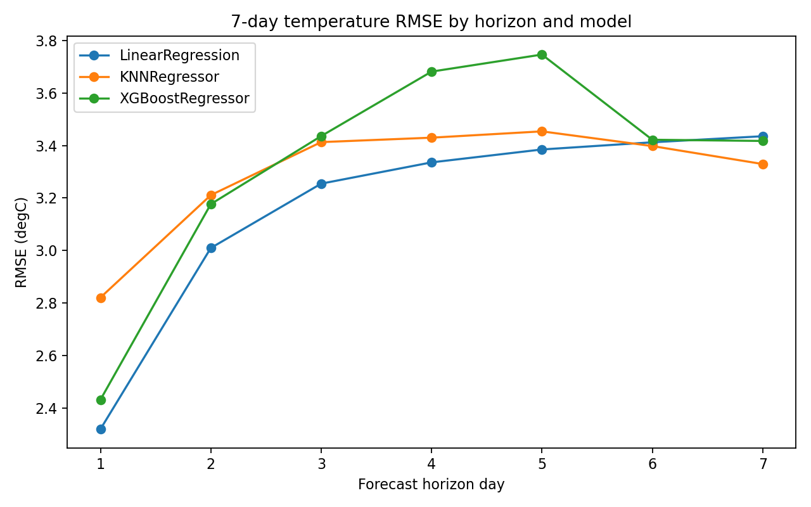
- 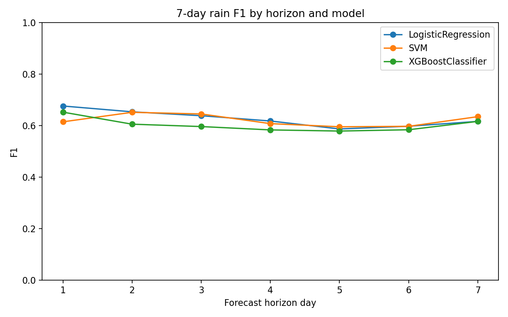
- 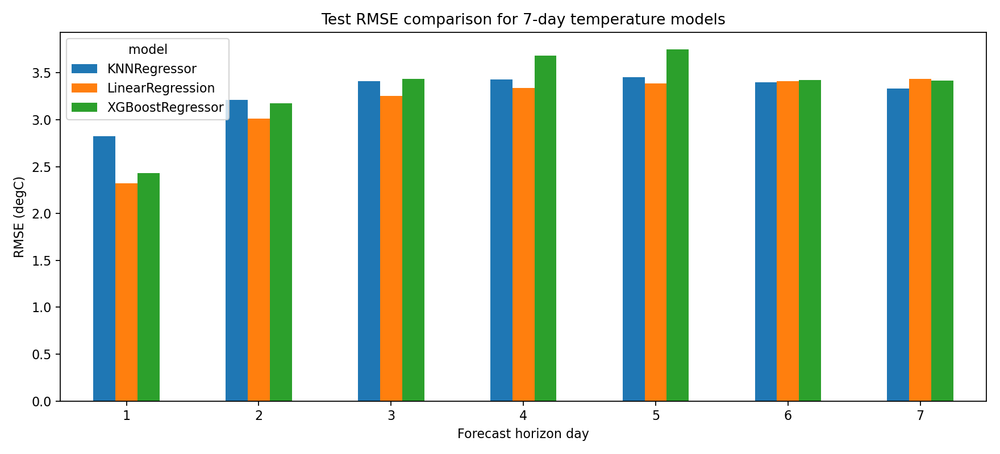
- 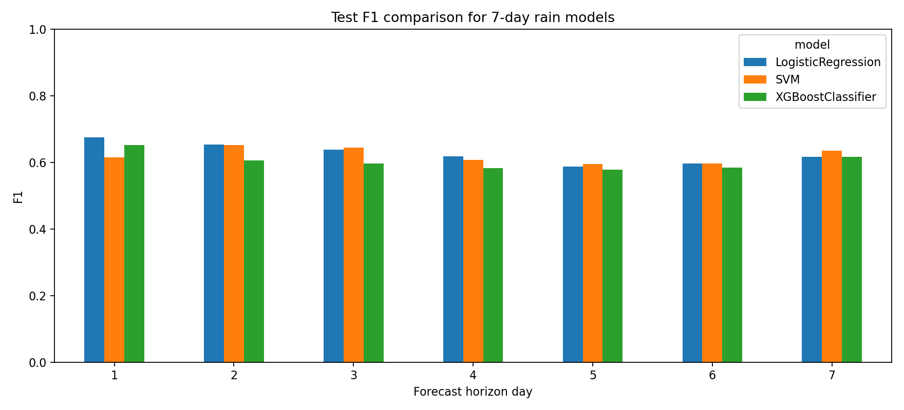
- 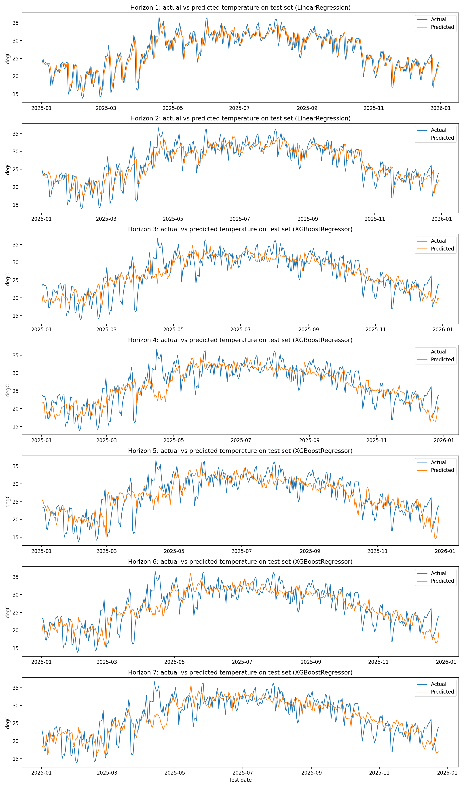
- 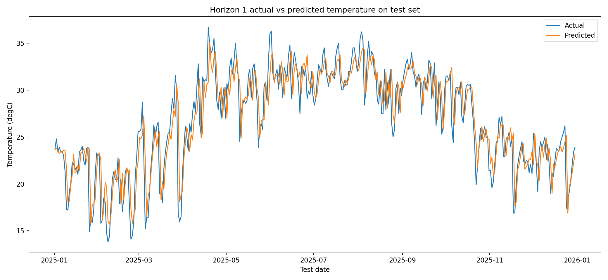
- 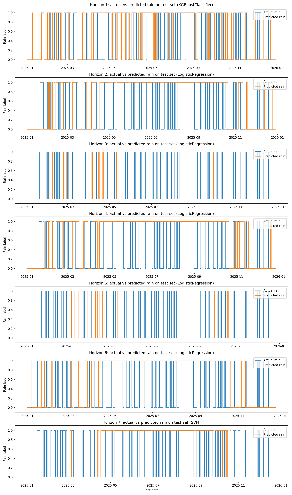
- 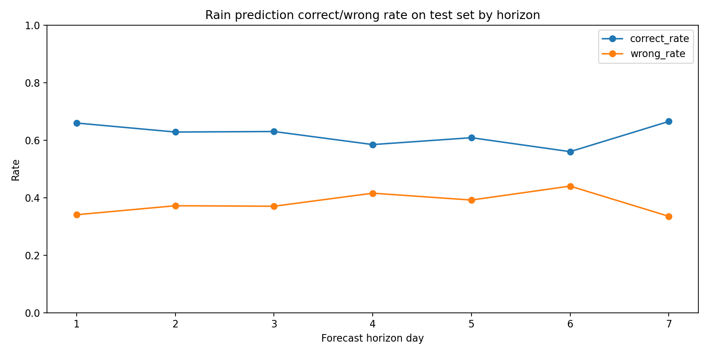
- 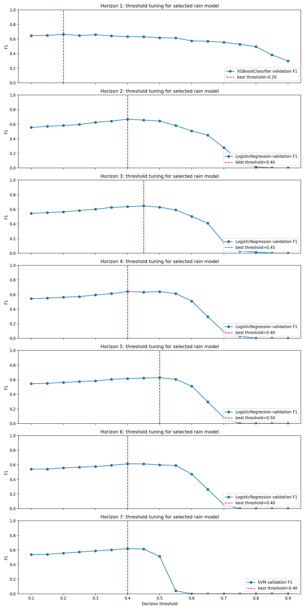
- 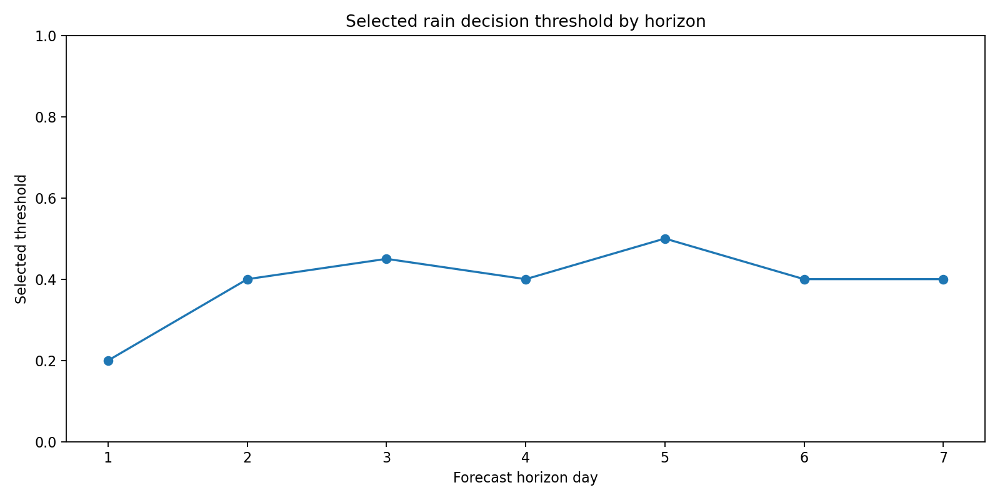
- 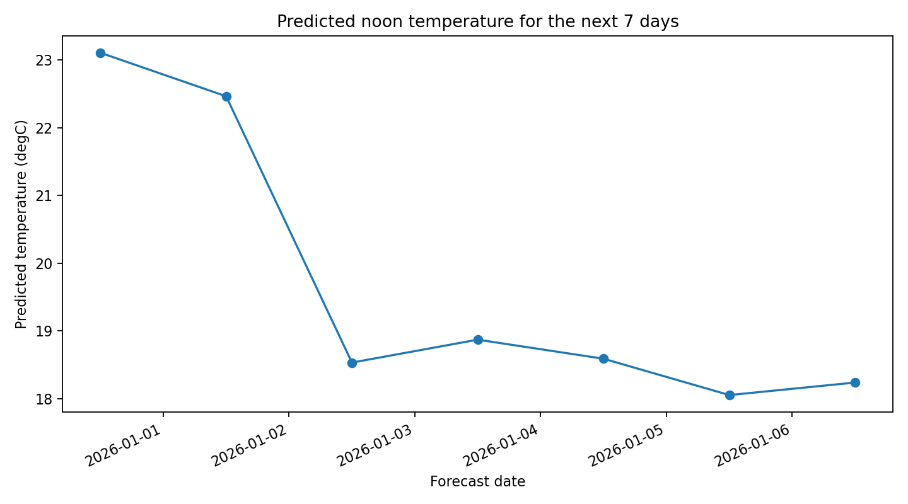
- 

## Data Visualization Interpretation
The temperature error plot compares RMSE across Linear Regression, KNN Regressor, and XGBoost Regressor for horizons 1 to 7. The best model is the one with the lowest validation RMSE for each horizon.

The rain performance plot compares F1 across Logistic Regression, SVM, and XGBoost Classifier. F1 is more informative than accuracy because the rain label is imbalanced. A decline or fluctuation in F1 indicates that the model has difficulty consistently identifying rainy days several days ahead.

The next-7-day temperature forecast plot visualizes the predicted cooling pattern from 2025-12-31 to 2026-01-06. The rain forecast plot indicates that the model predicts no rain for all seven future noon timestamps.

The test actual-vs-predicted temperature plot compares the best selected model's predicted values with true test values across the full 2025 test period. Each subplot corresponds to one forecast horizon. When the predicted curve follows the actual curve closely, the model captures the temporal temperature pattern well. Wider gaps indicate larger forecast errors.

The test actual-vs-predicted rain plot compares the binary rain labels across the full test period. Because rain is represented as 0/1, the plot should be interpreted as event matching rather than continuous magnitude matching. The correct/wrong rate plot summarizes how often the selected rain model matches the actual test label for each horizon.

The threshold tuning plots show how validation F1 changes as the rain decision threshold varies. Instead of using the default 0.5 threshold, the pipeline selects the threshold that maximizes validation F1 for each selected rain model and horizon. Lower thresholds usually increase recall but may reduce precision; higher thresholds usually improve precision but may miss more rain events.

## Evaluation and Discussion
The selected-model table shows which model is best at each horizon according to validation metrics. This is important because the model that performs best for day 1 does not necessarily remain best for day 7.

For temperature, model quality is judged by RMSE. Lower RMSE means lower average prediction error with stronger penalty for large errors. For rain, model quality is judged by F1, which balances precision and recall for the rainy class.

The 7-day output should therefore be interpreted as an academic multi-horizon forecasting result, not as a production-grade weather forecast. A real deployment would require future forecast covariates from numerical weather prediction models.

## Discussion
Temperature forecasting remains relatively stable across the first several horizons because temperature has strong temporal continuity and seasonal structure. However, error generally increases as the horizon becomes longer, which is expected in multi-step forecasting.

Rain forecasting is harder than temperature forecasting because rainfall is sparse and less continuous. F1 can fluctuate across horizons, indicating that rain/no-rain separation depends strongly on short-term atmospheric conditions that are not fully captured by historical noon observations alone.

## Limitations
The 7-day forecast uses historical observed features available at the latest noon record. For future days, the pipeline predicts horizon-specific targets directly rather than using real future meteorological forecast variables. A production-grade 7-day weather forecast should incorporate numerical weather prediction inputs such as future humidity, pressure, wind, cloud cover, and radiation forecasts.

Additional limitations:

- The system uses one location only.
- It does not ingest future meteorological forecasts.
- The same feature snapshot is used to infer all seven horizons.
- Rain prediction is sensitive to class imbalance and year-to-year variation.
- The models are intentionally simple for interpretability.

## Conclusion
This 7-day version provides an interpretable multi-horizon forecasting baseline for Hanoi noon temperature and rain prediction. It is suitable for academic comparison and reporting, but future work should add real forecast covariates and probabilistic rain calibration.

## Future Work
Future work should include:

- Numerical weather prediction features for future days.
- More locations across Hanoi and northern Vietnam.
- Probabilistic rain forecasts instead of only binary labels.
- Deep learning or time-series models for multi-step forecasting.
- Calibration and uncertainty intervals for temperature prediction.
